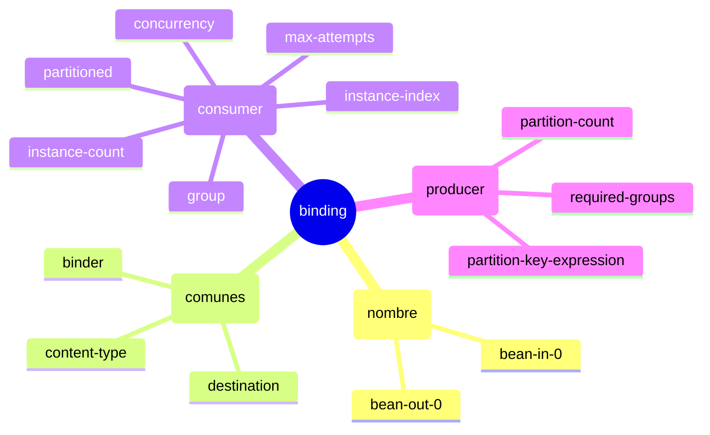

# 6.3 Spring Cloud Stream — Configuración de bindings

← [6.2 Modelo de programación funcional](sc-stream-modelo-funcional.md) | [Índice](README.md) | [6.4 Binder abstraction](sc-stream-binder-abstraction.md) →

---

## Introducción

La configuración de bindings es el vocabulario fundamental para conectar las funciones Java con el middleware de mensajería. Resuelve el problema de mapeo entre el nombre lógico del bean funcional y el destino físico (topic, exchange, queue) del broker. Existe porque el mismo bean puede apuntar a destinos distintos según el entorno, y toda esa variabilidad se gestiona mediante propiedades externas sin modificar código. Se necesita en cualquier proyecto que use Spring Cloud Stream para configurar destinos, grupos de consumidores, tipos de contenido y comportamiento del binding.

## Anatomía de un binding

Cada binding tiene un nombre derivado del bean funcional y un conjunto de propiedades configurables. El nombre sigue la convención `[nombre-bean]-in-[índice]` para inputs y `[nombre-bean]-out-[índice]` para outputs. La propiedad `destination` es el único campo obligatorio para producción; `group` es crítico para consumers.


*Jerarquía de propiedades de un binding: las comunes aplican a consumer y producer; las específicas sobrescriben solo su contexto.*

```
spring.cloud.stream.bindings.[nombre-binding].[propiedad] = valor

Ejemplo:
  spring.cloud.stream.bindings.processOrder-in-0.destination = orders-topic
  spring.cloud.stream.bindings.processOrder-in-0.group       = order-service
  spring.cloud.stream.bindings.processOrder-in-0.content-type = application/json
```

## Ejemplo central — configuración completa de bindings

El siguiente ejemplo muestra una aplicación con un `Function<String, String>` que tiene tanto binding de entrada como de salida, configurados con todas las propiedades clave:

```java
package com.example.stream;

import org.springframework.boot.SpringApplication;
import org.springframework.boot.autoconfigure.SpringBootApplication;
import org.springframework.context.annotation.Bean;
import java.util.function.Function;

@SpringBootApplication
public class OrderProcessorApplication {

    public static void main(String[] args) {
        SpringApplication.run(OrderProcessorApplication.class, args);
    }

    @Bean
    public Function<String, String> processOrder() {
        return order -> "PROCESSED:" + order;
    }
}
```

```yaml
# application.yml — configuración completa de bindings
spring:
  cloud:
    function:
      definition: processOrder

    stream:
      bindings:
        # Binding de entrada (consumer)
        processOrder-in-0:
          destination: orders-topic       # Nombre del topic/exchange en el broker
          group: order-processors         # Consumer group (competing consumers)
          content-type: application/json  # Tipo de serialización
          binder: kafka                   # Binder específico (si hay varios)
          consumer:
            max-attempts: 3              # Reintentos antes de DLQ
            back-off-initial-interval: 1000
            back-off-multiplier: 2.0
            concurrency: 2              # Threads de procesamiento

        # Binding de salida (producer)
        processOrder-out-0:
          destination: processed-orders   # Topic destino para la salida
          content-type: application/json
          producer:
            required-groups: audit-service  # Grupos que deben existir
            partition-key-expression: payload

      # Configuración global del Kafka binder
      kafka:
        binder:
          brokers: localhost:9092
          auto-create-topics: true
```

## Tabla de propiedades del binding

Las propiedades se dividen en comunes (aplican a consumer y producer), específicas de consumer y específicas de producer:

| Propiedad | Contexto | Descripción |
|-----------|----------|-------------|
| `destination` | Ambos | Nombre del topic (Kafka) o exchange (Rabbit). Obligatorio. |
| `group` | Consumer | Consumer group. Sin group = anonymous (recibe todos). |
| `content-type` | Ambos | Tipo MIME para serialización. Default: `application/json`. |
| `binder` | Ambos | Nombre del binder a usar (si hay múltiples). |
| `partitioned` | Consumer | `true` si el producer particiona mensajes. |
| `instance-index` | Consumer | Índice 0-based de esta instancia (para particionado). |
| `instance-count` | Consumer | Total de instancias (para particionado). |
| `consumer.max-attempts` | Consumer | Reintentos antes de enviar a DLQ. Default: 3. |
| `consumer.concurrency` | Consumer | Threads concurrentes para procesar mensajes. |
| `producer.partition-count` | Producer | Número de particiones para este producer. |
| `producer.partition-key-expression` | Producer | SpEL para calcular la clave de partición. |
| `producer.required-groups` | Producer | Grupos que deben existir antes de publicar. |

> [CONCEPTO] El nombre del binding (`processOrder-in-0`) es distinto al nombre del destino (`destination: orders-topic`). El binding name es el identificador lógico dentro de Spring Cloud Stream; el destination es el nombre físico en el broker. Esta distinción permite reutilizar el mismo destino con diferentes nombres de binding.

> [CONCEPTO] La propiedad `group` convierte un anonymous consumer en un durable consumer. Sin `group`, cada instancia de la aplicación recibe todos los mensajes (broadcast). Con `group`, las instancias del mismo grupo compiten por los mensajes (load balancing).

> [EXAMEN] La propiedad `content-type` en el binding es gestionada por Spring Cloud Stream como un hint para los `MessageConverter`. Si `useNativeEncoding=true`, esta propiedad es ignorada porque la serialización la hace el binder nativo (por ejemplo, KafkaSerializer de Kafka).

> [ADVERTENCIA] Si el nombre del bean funcional contiene caracteres especiales o es generado por lambda, Spring puede asignar un nombre no predecible. En ese caso, usar `spring.cloud.stream.function.bindings.[nombre-derivado]=[nombre-custom]` para renombrar el binding y luego configurar el binding custom.

## Buenas y malas prácticas

**Buenas prácticas:**
- Siempre configurar `group` en bindings consumer para garantizar durabilidad de suscripciones y comportamiento correcto al escalar.
- Usar nombres de destino (`destination`) que reflejen el dominio de negocio, no el nombre del bean.
- Externalizar la configuración de bindings al Config Server para cambiar destinos por entorno sin recompilar.

**Malas prácticas:**
- Confundir el nombre del binding con el nombre del destino: son independientes.
- Omitir `group` en aplicaciones que escalan horizontalmente (genera consumers anónimos con duplicación de mensajes).
- Usar `destination` igual al nombre del bean funcional: oscurece la intención y complica los cambios de nombre.

## Verificación y práctica

1. ¿Cuál es el nombre de binding auto-generado para el parámetro de entrada de un bean `Consumer<Order>` llamado `handleShipment`?

2. ¿Qué ocurre si se configura `spring.cloud.stream.bindings.processOrder-in-0.group=myGroup` y se despliegan 3 instancias de la aplicación con el mismo grupo?

3. ¿Qué propiedad permite usar un binder Kafka para el binding de entrada y un binder RabbitMQ para el binding de salida en la misma aplicación?

4. ¿Cuál es la diferencia entre `destination` y el nombre del binding en Spring Cloud Stream?

5. ¿Para qué sirve `spring.cloud.stream.function.bindings.[nombre-derivado]=[nombre-custom]` y en qué situación es necesario?

---

← [6.2 Modelo de programación funcional](sc-stream-modelo-funcional.md) | [Índice](README.md) | [6.4 Binder abstraction](sc-stream-binder-abstraction.md) →
