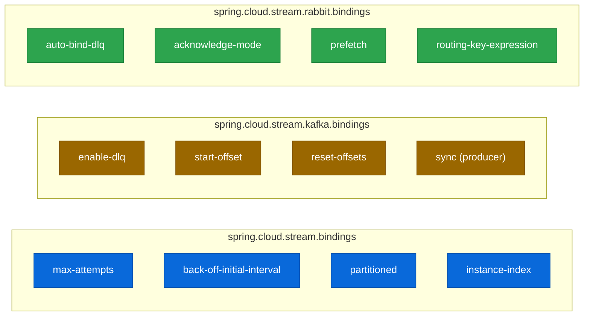

# 6.13 Spring Cloud Stream — Escenarios y preguntas de examen

← [6.12 Actuator](sc-stream-actuator.md) | [Índice](README.md) | [6.14 Testing](sc-stream-testing.md) →

---

## Introducción

Este fichero consolida los escenarios más evaluados del módulo Spring Cloud Stream en el examen VMware Spring Professional. Resuelve el problema de preparación para el examen al identificar las trampas más frecuentes, los conceptos que generan confusión y los patrones de pregunta recurrentes. Existe porque hay un conjunto de configuraciones y comportamientos en Spring Cloud Stream que son contraintuitivos o tienen matices que el examen explota sistemáticamente. Se necesita revisar antes del examen para evitar errores en preguntas de configuración, naming y comportamiento de bindings.

## Trampa 1 — Naming de bindings: convención -in-0 / -out-0

El nombre del binding se deriva del nombre del bean funcional más el sufijo, no del nombre del topic. Esta confusión es la trampa más frecuente del módulo.

```yaml
# Escenario: Bean llamado 'handleOrder', topic 'orders-topic'

# CORRECTO — el binding se configura por el nombre del BEAN:
spring:
  cloud:
    stream:
      bindings:
        handleOrder-in-0:         # ← nombre del bean + sufijo
          destination: orders-topic
          group: order-service

# INCORRECTO — usar el nombre del topic como nombre de binding:
# orders-topic:                   # ← NOMBRE DEL TOPIC, no del bean
#   destination: orders-topic
```

## Trampa 2 — Namespace de propiedades: binder-specific vs core

Spring Cloud Stream tiene dos namespaces distintos que se confunden frecuentemente. Las propiedades core de Stream son distintas de las específicas del Kafka binder.

```yaml
# CORE de Spring Cloud Stream (aplica a todos los binders):
spring.cloud.stream.bindings.[b].consumer.max-attempts: 3
spring.cloud.stream.bindings.[b].consumer.back-off-initial-interval: 1000
spring.cloud.stream.bindings.[b].consumer.partitioned: true

# ESPECÍFICO del Kafka binder:
spring.cloud.stream.kafka.bindings.[b].consumer.enable-dlq: true
spring.cloud.stream.kafka.bindings.[b].consumer.start-offset: earliest
spring.cloud.stream.kafka.bindings.[b].producer.sync: true

# ESPECÍFICO del RabbitMQ binder:
spring.cloud.stream.rabbit.bindings.[b].consumer.auto-bind-dlq: true
spring.cloud.stream.rabbit.bindings.[b].consumer.acknowledge-mode: MANUAL
```


*Separación de namespaces: el namespace core (`bindings`) aplica a cualquier binder; los namespaces `kafka.bindings` y `rabbit.bindings` son exclusivos de cada binder.*

## Trampa 3 — DLQ naming: Kafka vs RabbitMQ

El nombre del Dead Letter destino difiere entre binders. Es una pregunta directa del examen.

```
Kafka:   destination=orders-topic  → DLT: orders-topic.DLT
RabbitMQ: destination=orders + group=svc → DLQ: orders.svc.dlq
```

```yaml
# Habilitar DLQ en Kafka:
spring.cloud.stream.kafka.bindings.processOrder-in-0.consumer.enable-dlq: true
# topic DLT: orders-topic.DLT

# Habilitar DLQ en RabbitMQ:
spring.cloud.stream.rabbit.bindings.processOrder-in-0.consumer.auto-bind-dlq: true
# queue DLQ: orders-exchange.order-service.dlq
```

## Trampa 4 — startOffset vs resetOffsets

Confundir estas propiedades es un error clásico en preguntas de escenario sobre comportamiento en el primer arranque vs reinicios:

```yaml
# start-offset: earliest
# Solo aplica cuando el consumer group NO tiene offset guardado (primera ejecución)
# En reinicios: lee desde el último offset guardado (comportamiento normal)
spring.cloud.stream.kafka.bindings.input-in-0.consumer.start-offset: earliest

# reset-offsets: true
# Aplica en CADA arranque: resetea el offset al valor de start-offset
# PELIGROSO en producción: reprocesa todos los mensajes en cada reinicio
spring.cloud.stream.kafka.bindings.input-in-0.consumer.reset-offsets: true
spring.cloud.stream.kafka.bindings.input-in-0.consumer.start-offset: earliest
```

## Trampa 5 — Ambigüedad de beans funcionales

Cuando hay múltiples beans `Function`/`Consumer`/`Supplier`, `spring.cloud.function.definition` es obligatorio. Sin él, Spring lanza una excepción en el arranque.

```yaml
# INCORRECTO — dos beans sin definition:
# @Bean Consumer<String> handleOrder() { ... }
# @Bean Consumer<String> handlePayment() { ... }
# → ERROR: Ambiguous function bean resolution

# CORRECTO — seleccionar explícitamente:
spring:
  cloud:
    function:
      definition: handleOrder   # Solo activa handleOrder

# Para activar ambos (multi-function):
spring:
  cloud:
    function:
      definition: handleOrder;handlePayment
```

## Trampa 6 — Consumer group ausente en despliegues multi-instancia

Omitir `group` cuando se despliegan múltiples instancias resulta en duplicación del procesamiento. Es el error operacional más grave del módulo.

```yaml
# INCORRECTO — sin group, 3 instancias procesan 3 veces cada mensaje:
spring.cloud.stream.bindings.processOrder-in-0.destination: orders-topic
# (sin group)

# CORRECTO — con group, solo una instancia procesa cada mensaje:
spring.cloud.stream.bindings.processOrder-in-0.destination: orders-topic
spring.cloud.stream.bindings.processOrder-in-0.group: order-service
```

## Trampa 7 — @EnableBinding y @StreamListener son API eliminada

`@EnableBinding`, `@Input`, `@Output` y `@StreamListener` fueron eliminados en Spring Cloud Stream 3.x y no existen en SC 2025.x. El modelo funcional con `java.util.function.*` es el único soportado. [LEGACY]

```java
// ELIMINADO — no usar:
// @EnableBinding(Processor.class)
// public class OrderProcessor {
//     @StreamListener(Processor.INPUT)
//     @SendTo(Processor.OUTPUT)
//     public String process(String order) { return order; }
// }

// CORRECTO — modelo funcional:
@Bean
public Function<String, String> processOrder() {
    return order -> order + ":PROCESSED";
}
```

## Preguntas de examen tipo VMware Spring Professional

Las siguientes preguntas representan el nivel y formato del examen oficial. Cada una prueba un concepto específico del módulo:

**P1.** Un `Consumer<Order>` llamado `processShipment` está declarado como bean. ¿Cuál es el nombre del binding generado automáticamente y cómo se configura su `destination` a `shipments-topic`?

> Respuesta: El binding se llama `processShipment-in-0`. Configurar `spring.cloud.stream.bindings.processShipment-in-0.destination=shipments-topic`.

**P2.** Una aplicación tiene dos instancias con `group: payment-service`. Llegan 6 mensajes al topic. ¿Cuántos procesa cada instancia?

> Respuesta: Aproximadamente 3 cada una (load balancing entre instancias del mismo grupo). El total es 6, no 12.

**P3.** ¿Qué topic DLQ se crea automáticamente para `destination: transactions` con `enable-dlq: true` en el Kafka binder?

> Respuesta: `transactions.DLT` (patrón: `[destination].DLT`).

**P4.** ¿Qué diferencia hay entre `spring.cloud.stream.bindings.in-0.consumer.max-attempts` y `spring.cloud.stream.kafka.bindings.in-0.consumer.enable-dlq`?

> Respuesta: `max-attempts` está en el namespace core de Stream (aplica a cualquier binder). `enable-dlq` está en el namespace específico del Kafka binder.

**P5.** Se despliegan 3 instancias con `partitioned: true`, `instance-count: 3` pero todas con `instance-index: 0`. ¿Qué problema ocurre?

> Respuesta: Las tres instancias reciben los mensajes de la misma partición (índice 0). Las particiones 1 y 2 no tienen consumer asignado, acumulando mensajes sin procesar.

> [EXAMEN] La propiedad `spring.cloud.function.definition` tiene un separador `;` para múltiples beans activos independientes, y `|` para composición (pipeline). Confundirlos es un error de examen.

> [ADVERTENCIA] En Kafka, el número de instancias del consumer group no puede superar el número de particiones del topic para obtener paralelismo real. Las instancias sobrantes quedan ociosas sin partición asignada.

> [CONCEPTO] `PollableMessageSource` es la alternativa para control manual del polling. Se inyecta como bean y se llama `poll()` explícitamente. Es distinto del modelo push de `Consumer<T>`.

## Verificación y práctica

1. ¿Cuál es el nombre de binding para un bean `Function<String, Invoice>` llamado `generateInvoice` y cómo se configura su topic de entrada como `raw-orders` y de salida como `invoices`?

2. Una aplicación con tres beans funcionales (`processOrder`, `sendNotification`, `auditLog`) necesita activar solo los dos primeros. ¿Cómo se configura `spring.cloud.function.definition`?

3. ¿Qué nombre tendrá la DLQ en RabbitMQ para `destination=events` y `group=event-processor` con `auto-bind-dlq: true`?

4. ¿Por qué `reset-offsets: true` es peligroso en producción con Kafka binder?

5. Un `Supplier<Order>` llamado `generateOrder` está configurado. Sin ninguna configuración adicional, ¿con qué frecuencia produce mensajes y qué binding genera?

---

← [6.12 Actuator](sc-stream-actuator.md) | [Índice](README.md) | [6.14 Testing](sc-stream-testing.md) →
