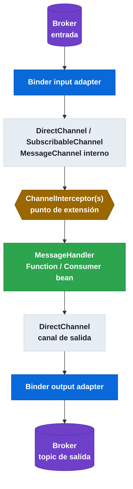

# 6.11 Spring Cloud Stream — Integración interna con Spring Integration

← [6.10 Serialización](sc-stream-serializacion.md) | [Índice](README.md) | [6.12 Actuator](sc-stream-actuator.md) →

---

## Introducción

Spring Integration es la infraestructura interna sobre la que Spring Cloud Stream construye sus bindings. Resuelve el problema de cómo conectar el modelo funcional de alto nivel (`Function`/`Consumer`/`Supplier`) con el transporte de mensajería de bajo nivel, usando un modelo de canales, handlers e interceptores probado y extensible. Existe porque Spring Cloud Stream necesita una capa de mensajería interna independiente del broker externo. Se necesita entender este vínculo cuando se quiere extensibilidad avanzada: interceptar mensajes internamente, usar `PollableMessageSource`, añadir trazabilidad con `MessageHistory`, o integrar componentes de Spring Integration directamente en una aplicación Stream.

## Arquitectura interna — Spring Integration como base

Los bindings de Spring Cloud Stream son implementados internamente como `MessageChannel`s de Spring Integration. El flujo completo desde el broker hasta el bean funcional atraviesa estos canales:


*Los bindings de Spring Cloud Stream son implementados como MessageChannels de Spring Integration; los ChannelInterceptors son el punto de extensión para logging, tracing o métricas sin modificar los beans funcionales.*

## Ejemplo central — PollableMessageSource y ChannelInterceptor

El siguiente ejemplo muestra dos casos de extensibilidad directa con Spring Integration: un `PollableMessageSource` para control manual del polling y un `ChannelInterceptor` para observabilidad:

```java
package com.example.stream;

import org.springframework.boot.SpringApplication;
import org.springframework.boot.autoconfigure.SpringBootApplication;
import org.springframework.cloud.stream.binder.PollableMessageSource;
import org.springframework.context.annotation.Bean;
import org.springframework.core.ParameterizedTypeReference;
import org.springframework.integration.channel.interceptor.WireTap;
import org.springframework.messaging.Message;
import org.springframework.messaging.MessageChannel;
import org.springframework.messaging.support.ChannelInterceptor;
import org.springframework.scheduling.annotation.EnableScheduling;
import org.springframework.scheduling.annotation.Scheduled;
import org.springframework.stereotype.Component;

@SpringBootApplication
@EnableScheduling
public class SpringIntegrationApplication {

    public static void main(String[] args) {
        SpringApplication.run(SpringIntegrationApplication.class, args);
    }

    // ChannelInterceptor para logging/tracing de todos los mensajes internos
    @Bean
    public ChannelInterceptor loggingInterceptor() {
        return new ChannelInterceptor() {
            @Override
            public Message<?> preSend(Message<?> message, MessageChannel channel) {
                System.out.println("Message on channel " + channel + ": " + message.getPayload());
                return message;
            }
        };
    }
}

// Polling consumer manual con PollableMessageSource
@Component
class BatchOrderProcessor {

    private final PollableMessageSource pollableSource;

    public BatchOrderProcessor(PollableMessageSource orderPollableSource) {
        this.pollableSource = orderPollableSource;
    }

    // Procesa mensajes de forma controlada cada 5 segundos en lugar de push continuo
    @Scheduled(fixedDelay = 5000)
    public void processBatch() {
        boolean hasMore = true;
        int count = 0;
        while (hasMore && count < 100) {
            hasMore = pollableSource.poll(
                message -> {
                    String order = (String) message.getPayload();
                    System.out.println("Batch processing: " + order);
                },
                new ParameterizedTypeReference<String>() {}
            );
            count++;
        }
        System.out.println("Batch processed " + count + " messages");
    }
}
```

```yaml
# application.yml
spring:
  cloud:
    stream:
      bindings:
        # Binding para PollableMessageSource (consumer pull en lugar de push)
        orderPollableSource-in-0:
          destination: orders-topic
          group: batch-processor
          consumer:
            max-attempts: 1    # Sin reintentos automáticos en polling manual

      kafka:
        binder:
          brokers: localhost:9092
```

## Tabla de componentes de Spring Integration relevantes en Stream

| Componente | Rol en Spring Cloud Stream | Extensibilidad |
|------------|---------------------------|----------------|
| `MessageChannel` | Canal interno entre binder y handler | Base de los bindings |
| `DirectChannel` | Canal síncrono punto a punto | Default para la mayoría de bindings |
| `SubscribableChannel` | Canal con múltiples suscriptores | Para fan-out interno |
| `MessageHandler` | Procesa mensajes del canal | El bean funcional es un `MessageHandler` |
| `ChannelInterceptor` | Intercepta mensajes en un canal | Logging, tracing, métricas |
| `WireTap` | Copia mensajes a otro canal (tap) | Auditoría sin alterar el flujo |
| `PollableMessageSource` | Polling manual del broker | Control explícito del throughput |
| `@InboundChannelAdapter` | Produce mensajes desde una fuente | Alternativa a `Supplier<T>` |
| `MessageHistory` | Registra el recorrido del mensaje | Trazabilidad interna |

> [CONCEPTO] `PollableMessageSource` es la abstracción que permite un modelo pull (el consumer pide mensajes) en lugar del modelo push (el broker envía mensajes al consumer). Es útil para procesamiento batch controlado, throttling explícito o integración con flujos que necesitan control de backpressure sin programación reactiva.

> [CONCEPTO] `@InboundChannelAdapter` es la alternativa basada en Spring Integration a `Supplier<T>`. Genera mensajes periódicamente y los inyecta en un canal. En aplicaciones Spring Cloud Stream modernas se prefiere `Supplier<T>` por su simplicidad, pero `@InboundChannelAdapter` sigue siendo válido para casos de integración legacy o configuraciones avanzadas.

> [EXAMEN] Los desarrolladores no necesitan interactuar con `DirectChannel` o `MessageHandler` directamente en aplicaciones Spring Cloud Stream estándar. Estos son detalles de implementación interna. Solo son relevantes para extensibilidad avanzada (interceptores, canales custom, integración con flujos de Spring Integration existentes).

> [ADVERTENCIA] Spring Cloud Bus usa Spring Cloud Stream como capa de transporte internamente, lo que significa que Bus también usa Spring Integration en última instancia. Comprender la jerarquía Bus → Stream → Spring Integration → Binder → Broker ayuda a diagnosticar problemas de configuración.

## Buenas y malas prácticas

**Buenas prácticas:**
- Usar `PollableMessageSource` cuando se necesita control explícito del ritmo de consumo (throttling, procesamiento batch).
- Usar `ChannelInterceptor` para logging y tracing centralizados sin modificar los beans funcionales.
- Preferir `Supplier<T>` sobre `@InboundChannelAdapter` en aplicaciones nuevas por simplicidad.

**Malas prácticas:**
- Interactuar directamente con `DirectChannel` o `MessageHandler` internos de Spring Cloud Stream (acoplamiento a detalles de implementación).
- Registrar `ChannelInterceptor` globales sin filtrado por canal (puede impactar el rendimiento al interceptar todos los mensajes internos).

## Verificación y práctica

1. ¿Qué tipo de `MessageChannel` usa Spring Cloud Stream internamente para implementar la mayoría de los bindings?

2. ¿Cuál es la diferencia entre el modelo push de `Consumer<T>` y el modelo pull de `PollableMessageSource`?

3. ¿En qué escenario se prefiere `PollableMessageSource` sobre un `Consumer<T>` funcional?

4. ¿Qué componente de Spring Integration permite copiar mensajes a un canal secundario para auditoría sin modificar el flujo principal?

5. ¿Cómo se relacionan Spring Cloud Bus, Spring Cloud Stream y Spring Integration en la jerarquía interna de Spring Cloud?

---

← [6.10 Serialización](sc-stream-serializacion.md) | [Índice](README.md) | [6.12 Actuator](sc-stream-actuator.md) →
