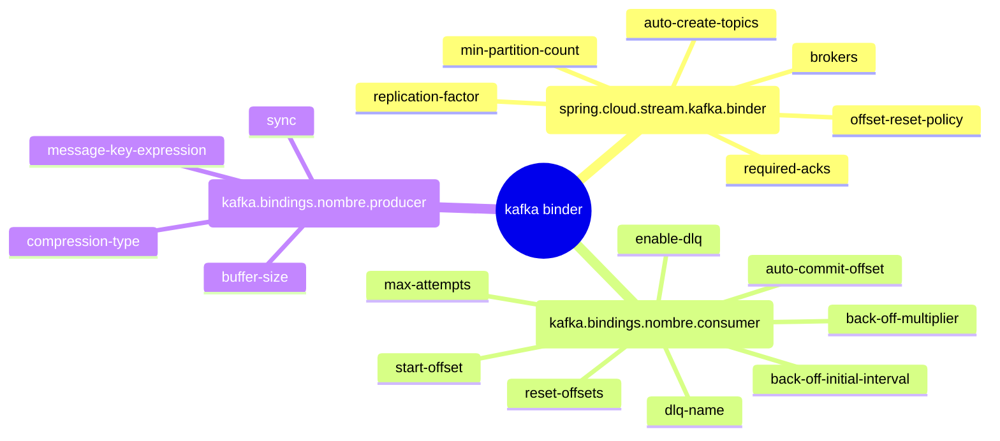
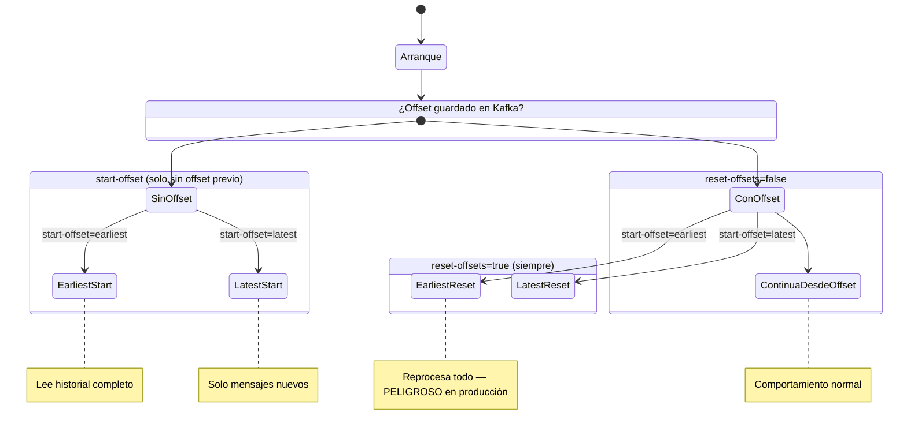

# 6.5 Spring Cloud Stream — Kafka binder: configuración completa

← [6.4 Binder abstraction](sc-stream-binder-abstraction.md) | [Índice](README.md) | [6.6 RabbitMQ binder](sc-stream-rabbit-binder.md) →

---

## Introducción

El Kafka binder es la implementación más utilizada de la abstracción Binder en Spring Cloud Stream. Resuelve el problema de configurar todos los aspectos de la integración con Apache Kafka — brokers, particiones, offsets, compresión, DLQ — sin escribir código de bajo nivel con `KafkaTemplate` o `KafkaAdmin`. Existe porque Kafka tiene un modelo de configuración extenso y específico que debe ser controlable por entorno. Se necesita en cualquier aplicación event-driven que use Kafka como broker de mensajería con Spring Cloud Stream.

## Jerarquía de propiedades del Kafka binder

Las propiedades del Kafka binder se organizan en tres niveles: globales del binder, por binding consumer y por binding producer. Las propiedades globales afectan a todos los bindings Kafka; las de binding sobrescriben el comportamiento para ese binding específico.


*Tres niveles de configuración del Kafka binder: global aplica a todos los bindings; consumer y producer sobrescriben por binding específico.*

## Ejemplo central — configuración completa del Kafka binder

El siguiente ejemplo muestra una aplicación `Function<String, String>` con configuración exhaustiva del Kafka binder, incluyendo DLQ, control de offsets y producer síncrono:

```java
package com.example.stream;

import org.springframework.boot.SpringApplication;
import org.springframework.boot.autoconfigure.SpringBootApplication;
import org.springframework.context.annotation.Bean;
import java.util.function.Function;

@SpringBootApplication
public class KafkaStreamApplication {

    public static void main(String[] args) {
        SpringApplication.run(KafkaStreamApplication.class, args);
    }

    @Bean
    public Function<String, String> processOrder() {
        return order -> "INVOICED:" + order;
    }
}
```

```yaml
# application.yml — configuración exhaustiva del Kafka binder
spring:
  cloud:
    function:
      definition: processOrder

    stream:
      bindings:
        processOrder-in-0:
          destination: orders-topic
          group: order-service
          content-type: application/json
        processOrder-out-0:
          destination: invoices-topic
          content-type: application/json

      # Configuración global del Kafka binder
      kafka:
        binder:
          brokers: localhost:9092            # Lista de brokers
          auto-create-topics: true           # Crea topics automáticamente si no existen
          auto-add-partitions: false         # No añade particiones a topics existentes
          replication-factor: 1             # Factor de réplica para topics creados por Stream
          required-acks: -1                 # Confirmación del leader + réplicas (ISR)
          min-partition-count: 1            # Particiones mínimas al crear topic
          offset-reset-policy: latest       # latest | earliest (política global)

        # Configuración específica del consumer binding
        bindings:
          processOrder-in-0:
            consumer:
              start-offset: earliest        # earliest | latest para nuevo grupo
              auto-commit-offset: true      # Commit automático de offsets
              enable-dlq: true             # Habilita Dead Letter Topic
              dlq-name: orders-topic.DLT   # Nombre explícito del DLT (por defecto: [dest].DLT)
              reset-offsets: false          # true = resetea offset al arrancar
              max-attempts: 3              # Reintentos en la capa de Stream
              back-off-initial-interval: 1000  # 1 segundo inicial
              back-off-max-interval: 10000     # máximo 10 segundos
              back-off-multiplier: 2.0         # duplica en cada reintento

          # Configuración específica del producer binding
          processOrder-out-0:
            producer:
              sync: true                    # Espera ACK del broker antes de continuar
              compression-type: snappy      # none | gzip | snappy | lz4 | zstd
              buffer-size: 16384           # Buffer del producer en bytes
              message-key-expression: "headers['partitionKey']"  # SpEL para clave del record
```

## Tabla de propiedades del Kafka binder

Las propiedades más importantes, organizadas por nivel y función:

| Propiedad (nivel binder global) | Descripción | Valor por defecto |
|--------------------------------|-------------|-------------------|
| `brokers` | Lista de Kafka brokers | `localhost:9092` |
| `auto-create-topics` | Crea topics si no existen | `true` |
| `replication-factor` | Réplicas de los topics creados | `1` |
| `offset-reset-policy` | Política global de reset de offset | `latest` |

| Propiedad (consumer por binding) | Descripción | Valor por defecto |
|---------------------------------|-------------|-------------------|
| `start-offset` | Offset inicial para nuevo grupo | `null` (usa broker default) |
| `auto-commit-offset` | Commit automático de offsets | `true` |
| `enable-dlq` | Activa Dead Letter Topic | `false` |
| `dlq-name` | Nombre del DLT (override) | `[destination].DLT` |
| `reset-offsets` | Resetea offset al arrancar | `false` |

| Propiedad (producer por binding) | Descripción | Valor por defecto |
|----------------------------------|-------------|-------------------|
| `sync` | Envío síncrono (espera ACK) | `false` |
| `compression-type` | Algoritmo de compresión | `none` |
| `message-key-expression` | SpEL para clave del record Kafka | `null` |

> [CONCEPTO] El Dead Letter Topic (DLT) en Kafka se nombra automáticamente como `[destination].DLT`. Por ejemplo, si el topic es `orders-topic` y `enable-dlq: true`, los mensajes que agotan reintentos van a `orders-topic.DLT`. Se puede sobrescribir con `dlq-name`.

> [CONCEPTO] `start-offset` solo aplica cuando el consumer group no tiene offset guardado (primera ejecución). `reset-offsets: true` fuerza el reset al offset indicado en cada arranque, independientemente de si ya existen offsets guardados. Son comportamientos distintos y confundirlos es un error frecuente.

> [EXAMEN] `enable-dlq: true` está en `spring.cloud.stream.kafka.bindings.[nombre].consumer.*`, no en `spring.cloud.stream.bindings.[nombre].consumer.*`. Son namespaces distintos: el primero es específico del Kafka binder; el segundo es el namespace común de Stream.

> [ADVERTENCIA] `sync: true` en el producer Kafka puede impactar significativamente el throughput porque cada envío espera la confirmación del broker antes de continuar. Se recomienda solo cuando se necesitan garantías de entrega estrictas.

## Comparación — startOffset vs resetOffsets

Estos dos conceptos son confundidos frecuentemente en el examen:

| Propiedad | Cuándo aplica | Comportamiento |
|-----------|---------------|----------------|
| `start-offset: earliest` | Solo primera ejecución del grupo | Lee desde el inicio del topic |
| `start-offset: latest` | Solo primera ejecución del grupo | Lee solo mensajes nuevos |
| `reset-offsets: true` + `start-offset` | En cada reinicio de la app | Resetea siempre el offset |
| `reset-offsets: false` | En cada reinicio de la app | Continúa desde el último offset guardado |


*`start-offset` solo aplica la primera vez que el grupo arranca (sin offset guardado); `reset-offsets: true` fuerza el reset en cada reinicio.*

## Buenas y malas prácticas

**Buenas prácticas:**
- Usar `enable-dlq: true` en consumers de producción para no perder mensajes que fallan repetidamente.
- Configurar `back-off-initial-interval` y `back-off-multiplier` para evitar tormentas de reintentos.
- Usar `start-offset: earliest` en consumer groups nuevos cuando se necesita procesar el historial completo del topic.

**Malas prácticas:**
- Configurar `reset-offsets: true` en producción sin entender que resetea los offsets en cada reinicio.
- Confundir `spring.cloud.stream.kafka.bindings.*` con `spring.cloud.stream.bindings.*`.
- Usar `sync: true` en producers de alta frecuencia sin medir el impacto en latencia.

## Verificación y práctica

1. ¿Cuál es el nombre del Dead Letter Topic generado automáticamente para un binding con `destination: payments-topic` y `enable-dlq: true`?

2. ¿En qué namespace de propiedades se configura `enable-dlq` para el Kafka binder: en `spring.cloud.stream.bindings.*` o en `spring.cloud.stream.kafka.bindings.*`?

3. ¿Cuál es la diferencia entre `start-offset: earliest` y `reset-offsets: true` con `start-offset: earliest`?

4. ¿Qué propiedad del producer Kafka permite especificar la clave del record mediante una expresión SpEL?

5. Si se configura `auto-create-topics: false` y el topic no existe en el broker, ¿qué ocurre al arrancar la aplicación?

---

← [6.4 Binder abstraction](sc-stream-binder-abstraction.md) | [Índice](README.md) | [6.6 RabbitMQ binder](sc-stream-rabbit-binder.md) →
