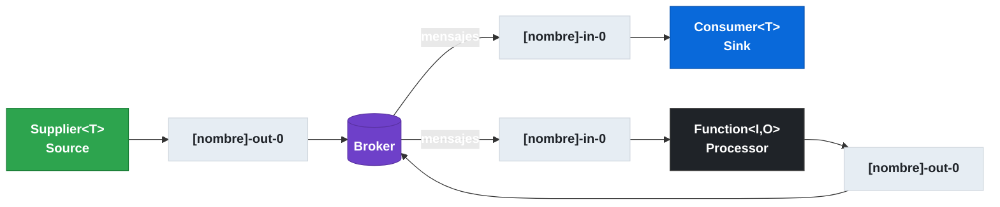
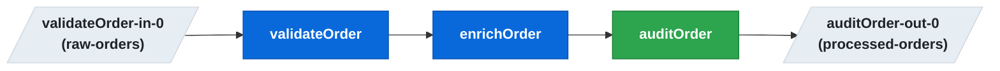

# 6.2 Spring Cloud Stream — Modelo de programación funcional

← [6.1 Setup y dependencias](sc-stream-setup.md) | [Índice](README.md) | [6.3 Configuración de bindings](sc-stream-bindings-config.md) →

---

## Introducción

El modelo de programación funcional de Spring Cloud Stream resuelve el problema de acoplamiento entre la lógica de procesamiento de mensajes y la infraestructura del broker. Existe porque el framework adopta tipos estándar de `java.util.function` (`Function`, `Consumer`, `Supplier`) como contrato de programación, eliminando la necesidad de anotaciones propietarias. Se necesita cada vez que se define un handler de mensajes, un productor periódico o un procesador entrada/salida en una aplicación event-driven.

## Mapeo de tipos funcionales a roles en mensajería

Cada tipo funcional de `java.util.function` tiene un rol específico en Spring Cloud Stream. La siguiente tabla muestra la correspondencia entre el tipo Java, el rol en mensajería y los bindings generados automáticamente:

| Tipo Java | Rol en Stream | Binding generado | Descripción |
|-----------|--------------|-----------------|-------------|
| `Consumer<T>` | Sink (solo consume) | `[nombre]-in-0` | Recibe mensajes, sin salida |
| `Supplier<T>` | Source (solo produce) | `[nombre]-out-0` | Produce mensajes periódicamente |
| `Function<I,O>` | Processor (consume y produce) | `[nombre]-in-0` + `[nombre]-out-0` | Transforma mensajes |


*Relación entre cada tipo funcional Java, los bindings generados automáticamente y la dirección del flujo de mensajes.*

## Ejemplo central — Function, Consumer y Supplier

El siguiente ejemplo muestra los tres tipos funcionales en una misma aplicación. Cuando hay un solo bean funcional, Spring Cloud Stream lo detecta automáticamente. Cuando hay varios, se debe usar `spring.cloud.function.definition` para resolver la ambigüedad.

```java
package com.example.stream;

import org.springframework.boot.SpringApplication;
import org.springframework.boot.autoconfigure.SpringBootApplication;
import org.springframework.context.annotation.Bean;
import java.util.function.Consumer;
import java.util.function.Function;
import java.util.function.Supplier;

@SpringBootApplication
public class FunctionalStreamApplication {

    public static void main(String[] args) {
        SpringApplication.run(FunctionalStreamApplication.class, args);
    }

    // SINK: genera binding 'handleOrder-in-0'
    @Bean
    public Consumer<String> handleOrder() {
        return order -> System.out.println("Processing order: " + order);
    }

    // SOURCE: genera binding 'heartbeat-out-0' (polling cada segundo por defecto)
    @Bean
    public Supplier<String> heartbeat() {
        return () -> "PING-" + System.currentTimeMillis();
    }

    // PROCESSOR: genera 'enrichOrder-in-0' y 'enrichOrder-out-0'
    @Bean
    public Function<String, String> enrichOrder() {
        return order -> order.toUpperCase() + "-ENRICHED";
    }
}
```

```yaml
# application.yml — resolución de ambigüedad con múltiples beans
spring:
  cloud:
    function:
      # Con un solo bean no es necesario. Con varios, OBLIGATORIO.
      definition: handleOrder

    stream:
      bindings:
        handleOrder-in-0:
          destination: orders-topic
          group: order-service
```

## Composición de funciones

Spring Cloud Stream permite componer funciones usando el operador `|` (pipe) en `spring.cloud.function.definition`. La composición encadena la salida de una función como entrada de la siguiente, creando un pipeline de procesamiento. Solo se exponen los bindings extremos del pipeline (entrada del primero y salida del último).


*Pipeline `validateOrder|enrichOrder|auditOrder`: solo los bindings extremos se exponen al broker; los intermedios son internos.*

```yaml
spring:
  cloud:
    function:
      # Composición: validate -> enrich -> audit
      # Bindings generados: validateOrder-in-0 y auditOrder-out-0
      definition: validateOrder|enrichOrder|auditOrder

    stream:
      bindings:
        validateOrder-in-0:
          destination: raw-orders
          group: pipeline-service
        auditOrder-out-0:
          destination: processed-orders
```

```java
// Cada función se define como bean independiente
@Bean
public Function<String, String> validateOrder() {
    return order -> {
        if (order == null || order.isBlank()) throw new IllegalArgumentException("Invalid order");
        return order;
    };
}

@Bean
public Function<String, String> enrichOrder() {
    return order -> order + ":ENRICHED";
}

@Bean
public Function<String, String> auditOrder() {
    return order -> {
        System.out.println("Audit: " + order);
        return order;
    };
}
```

## Tabla de elementos clave

Las siguientes propiedades controlan el modelo funcional en Spring Cloud Stream:

| Propiedad | Descripción | Ejemplo |
|-----------|-------------|---------|
| `spring.cloud.function.definition` | Selecciona el bean activo o define composición | `handleOrder` / `validate\|enrich` |
| `spring.cloud.stream.function.bindings.[nombre]` | Renombra un binding derivado automáticamente | `handleOrder-in-0=myInput` |

> [CONCEPTO] El nombre del binding se deriva del nombre del bean funcional más el sufijo `-in-0` para input y `-out-0` para output. El índice (`0`) permite múltiples inputs/outputs en beans que reciben tipos como `Tuple` o tienen variantes reactivas.

> [CONCEPTO] `spring.cloud.function.definition` es obligatorio cuando el contexto contiene más de un bean `Function`/`Consumer`/`Supplier`. Sin esta propiedad, Spring Cloud Stream lanzará una excepción indicando que no puede resolver el bean funcional único.

> [ADVERTENCIA] `@StreamListener`, `@EnableBinding`, `@Input` y `@Output` fueron eliminados (no solo deprecados) en Spring Cloud Stream 3.x. No aparecen en proyectos modernos con Spring Cloud 2025.x. [LEGACY]

> [EXAMEN] Un `Supplier<T>` produce mensajes de forma periódica mediante un scheduler interno (por defecto cada segundo). No hay mensaje entrante que lo dispare; es una fuente activa. Para control manual del polling se usa `PollableMessageSource`.

## Buenas y malas prácticas

**Buenas prácticas:**
- Siempre declarar `spring.cloud.function.definition` aunque haya un único bean funcional, para mayor claridad y evitar sorpresas al añadir más beans.
- Usar nombres de beans descriptivos y consistentes con el dominio: `processOrder`, `handlePayment`.
- Preferir `Function<I,O>` sobre la combinación manual de `Consumer` + `Supplier` cuando hay transformación.

**Malas prácticas:**
- Omitir `spring.cloud.function.definition` cuando hay múltiples beans funcionales (produce error de ambigüedad).
- Usar `@StreamListener` o cualquier anotación del modelo legacy eliminado. [LEGACY]
- Usar nombres de beans con guiones o caracteres especiales que compliquen los nombres de binding derivados.

## Verificación y práctica

1. ¿Qué bindings genera automáticamente Spring Cloud Stream para un bean `Function<Order, Invoice>` llamado `processOrder`?

2. Si una aplicación contiene dos beans: `Consumer<String> handleOrder` y `Consumer<String> handlePayment`, ¿qué propiedad se debe configurar para activar solo `handleOrder`, y qué ocurre si se omite?

3. ¿Cuál es la sintaxis de `spring.cloud.function.definition` para componer tres funciones `validate`, `enrich` y `publish` en un pipeline?

4. Un `Supplier<String>` llamado `heartbeat` está declarado como bean. ¿Con qué frecuencia produce mensajes por defecto y qué binding genera?

5. ¿Por qué `@StreamListener` ya no se puede usar en aplicaciones con Spring Cloud Stream 4.x?

---

← [6.1 Setup y dependencias](sc-stream-setup.md) | [Índice](README.md) | [6.3 Configuración de bindings](sc-stream-bindings-config.md) →
