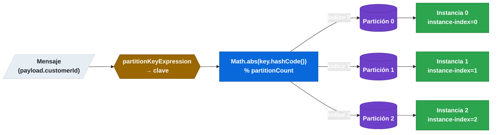

# 6.8 Spring Cloud Stream — Particionado y afinidad de mensajes

← [6.7 Consumer Groups](sc-stream-consumer-groups.md) | [Índice](README.md) | [6.9 Error handling](sc-stream-error-handling.md) →

---

## Introducción

El particionado en Spring Cloud Stream garantiza que todos los mensajes con la misma clave lógica sean procesados siempre por la misma instancia del consumer. Resuelve el problema de afinidad de mensajes: cuando el estado del procesamiento está en memoria o en caché local, es fundamental que todos los mensajes del mismo cliente, pedido o entidad lleguen siempre a la misma instancia. Existe como abstracción portable sobre el particionado nativo de Kafka y el particionado gestionado de RabbitMQ. Se necesita en escenarios de agregación por clave, caché local particionada, o procesamiento stateful.

## Flujo del particionado — producer a consumer

El flujo de particionado involucra propiedades distintas en el producer (qué clave usar, cuántas particiones) y en el consumer (qué instancia soy, cuántas hay en total):


*La clave calculada por SpEL se hashea módulo `partitionCount`; cada partición queda asignada a la instancia consumer con el `instance-index` correspondiente.*

## Ejemplo central — configuración de particionado completa

El siguiente ejemplo muestra cómo configurar un sistema donde todos los mensajes del mismo `customerId` siempre llegan a la misma instancia del consumer:

```java
package com.example.stream;

import org.springframework.boot.SpringApplication;
import org.springframework.boot.autoconfigure.SpringBootApplication;
import org.springframework.context.annotation.Bean;
import java.util.function.Consumer;
import java.util.function.Supplier;

@SpringBootApplication
public class PartitionedStreamApplication {

    public static void main(String[] args) {
        SpringApplication.run(PartitionedStreamApplication.class, args);
    }

    // Producer: genera órdenes con customerId en el payload
    @Bean
    public Supplier<String> sendOrder() {
        return () -> "{\"customerId\": \"C001\", \"amount\": 100}";
    }

    // Consumer: recibe mensajes de su partición asignada
    @Bean
    public Consumer<String> processOrder() {
        return order -> System.out.println("Processing on instance " + order);
    }
}
```

```yaml
# application.yml — configuración de particionado
spring:
  cloud:
    function:
      definition: processOrder

    stream:
      bindings:
        # PRODUCER: define la clave y el número de particiones
        sendOrder-out-0:
          destination: orders-topic
          producer:
            partition-key-expression: payload.customerId   # SpEL sobre el payload
            partition-count: 3                            # Debe coincidir con las particiones del topic

        # CONSUMER: declara que está particionado y su índice
        processOrder-in-0:
          destination: orders-topic
          group: order-service
          consumer:
            partitioned: true      # OBLIGATORIO para consumers particionados
            instance-index: 0      # Índice de esta instancia (0, 1 o 2)
            instance-count: 3      # Total de instancias

      kafka:
        binder:
          brokers: localhost:9092
```

```yaml
# Para la instancia 1 (application-instance1.yml):
spring:
  cloud:
    stream:
      bindings:
        processOrder-in-0:
          consumer:
            instance-index: 1
            instance-count: 3
```

## Tabla de propiedades del particionado

| Propiedad | Contexto | Descripción |
|-----------|----------|-------------|
| `producer.partition-key-expression` | Producer | SpEL para calcular la clave de partición |
| `producer.partition-key-extractor-name` | Producer | Nombre del bean `PartitionKeyExtractorStrategy` (alternativa a SpEL) |
| `producer.partition-count` | Producer | Número de particiones del canal de salida |
| `producer.partition-selector-expression` | Producer | SpEL para seleccionar la partición destino (override de la fórmula default) |
| `consumer.partitioned` | Consumer | `true` activa el modo particionado en el consumer |
| `consumer.instance-index` | Consumer | Índice 0-based de esta instancia |
| `consumer.instance-count` | Consumer | Número total de instancias del grupo |

> [CONCEPTO] La expresión `partition-key-expression` es una expresión SpEL evaluada sobre el objeto mensaje. `payload` referencia el payload del mensaje. `headers` referencia las cabeceras. Por ejemplo: `payload.customerId` extrae el campo `customerId` del objeto payload; `headers['partitionKey']` extrae una cabecera.

> [CONCEPTO] `partition-count` en el producer debe coincidir con el número real de particiones del topic en Kafka (o el equivalente en RabbitMQ). Si `auto-add-partitions: true` en el Kafka binder, el topic se crea/ajusta con ese número de particiones automáticamente.

> [EXAMEN] `instance-index` es 0-based y debe ser único por instancia del grupo. Si hay 3 instancias con `instance-count: 3`, los índices deben ser 0, 1 y 2. Si dos instancias tienen el mismo `instance-index`, ambas reciben los mensajes de la misma partición, perdiendo la garantía de afinidad.

> [ADVERTENCIA] En Kubernetes o PaaS con autoescalado, el `instance-index` debe configurarse dinámicamente (por variable de entorno o Config Server) para garantizar que cada pod tiene un índice único. El error más común es desplegar todas las instancias con `instance-index: 0`.

## Comparación — particionado nativo Kafka vs particionado gestionado Stream

| Aspecto | Kafka nativo | Stream particionado |
|---------|-------------|---------------------|
| Clave de partición | `messageKeyExpression` en producer | `partition-key-expression` |
| Garantía de orden | Por partición Kafka | Por partición lógica de Stream |
| Consumer assignment | Kafka consumer group protocol | `instance-index` + `instance-count` |
| Transparencia binder | No (solo Kafka) | Sí (funciona en Kafka y RabbitMQ) |

## Buenas y malas prácticas

**Buenas prácticas:**
- Siempre asegurarse de que `partition-count` del producer coincide con el número de particiones del topic.
- Configurar `instance-index` mediante variables de entorno en despliegues dinámicos.
- Usar `partitioned: true` en todos los consumers del grupo cuando el producer está particionado.

**Malas prácticas:**
- Desplegar dos instancias con el mismo `instance-index` (rompe la garantía de afinidad).
- Configurar `partitioned: true` sin `instance-index` e `instance-count` (el consumer no sabe qué partición atender).
- Aumentar el número de instancias sin actualizar `instance-count` en todos los consumers.

## Verificación y práctica

1. ¿Cómo se garantiza que todos los mensajes con el mismo `customerId` sean procesados por la misma instancia del consumer en Spring Cloud Stream?

2. Si hay 3 instancias del consumer con `instance-count: 3`, ¿qué valores debe tener `instance-index` en cada una?

3. ¿Qué ocurre si dos instancias del consumer tienen el mismo `instance-index: 0` con `instance-count: 3`?

4. ¿Cuál es la fórmula por defecto que Spring Cloud Stream usa para calcular la partición destino a partir de la clave?

5. ¿Por qué es necesario que `partition-count` en el producer coincida con el número real de particiones del topic en Kafka?

---

← [6.7 Consumer Groups](sc-stream-consumer-groups.md) | [Índice](README.md) | [6.9 Error handling](sc-stream-error-handling.md) →
