# 6.10 Spring Cloud Stream — Serialización y contentType

← [6.9 Error handling](sc-stream-error-handling.md) | [Índice](README.md) | [6.11 Integración Spring Integration](sc-stream-integracion-spring-integration.md) →

---

## Introducción

La serialización en Spring Cloud Stream controla cómo los objetos Java se convierten en bytes para transmitirse por el broker y cómo los bytes se convierten de vuelta en objetos. Resuelve el problema de la interoperabilidad entre producers y consumers que pueden estar escritos en distintos lenguajes o frameworks. Existe porque el middleware de mensajería solo transmite bytes, y el framework debe gestionar la conversión de forma transparente y configurable. Se necesita entender este mecanismo cuando se trabaja con formatos distintos a JSON, cuando se usa Avro con Schema Registry, o cuando se delega la serialización al binder nativo.

## Ciclo de serialización en Spring Cloud Stream

El ciclo de conversión de mensajes es bidireccional. En el producer, el POJO se convierte a bytes; en el consumer, los bytes se convierten de vuelta al tipo esperado por el bean funcional:

```mermaid
flowchart LR
    subgraph "Producer"
        direction LR
        POJO_P["POJO\n(Order)"]
        CONV_P["MessageConverter\napplication/json → Jackson"]
        BYTES_P["Message&lt;byte[]&gt;"]
        BINDER_P["Binder"]
    end
    subgraph "Consumer"
        direction LR
        BINDER_C["Binder"]
        BYTES_C["Message&lt;byte[]&gt;"]
        CONV_C["MessageConverter\napplication/json → Jackson"]
        POJO_C["POJO\n(Order)"]
        HANDLER["Function/Consumer\nhandler"]
    end
    BROKER[(Broker\ntopic/queue)]

    POJO_P --> CONV_P --> BYTES_P --> BINDER_P --> BROKER
    BROKER --> BINDER_C --> BYTES_C --> CONV_C --> POJO_C --> HANDLER

    classDef root      fill:#1f2328,color:#fff,stroke:#444,font-weight:bold
    classDef primary   fill:#0969da,color:#fff,stroke:#0550ae
    classDef secondary fill:#2da44e,color:#fff,stroke:#1a7f37
    classDef warning   fill:#9a6700,color:#fff,stroke:#7d4e00
    classDef storage   fill:#6e40c9,color:#fff,stroke:#5a32a3
    classDef neutral   fill:#e6edf3,color:#1f2328,stroke:#d0d7de

    class POJO_P,POJO_C neutral
    class CONV_P,CONV_C warning
    class BYTES_P,BYTES_C neutral
    class BINDER_P,BINDER_C primary
    class BROKER storage
    class HANDLER secondary
```


*Ciclo bidireccional de serialización: el POJO se convierte a bytes en el producer y los bytes se reconstituyen como POJO en el consumer mediante `MessageConverter`.*

## Ejemplo central — configuración de serialización

El siguiente ejemplo muestra distintos escenarios de contentType: JSON estándar, Avro con Schema Registry, y native encoding para Kafka:

```java
package com.example.stream;

import org.springframework.boot.SpringApplication;
import org.springframework.boot.autoconfigure.SpringBootApplication;
import org.springframework.context.annotation.Bean;
import java.util.function.Consumer;
import java.util.function.Function;

@SpringBootApplication
public class SerializationApplication {

    public static void main(String[] args) {
        SpringApplication.run(SerializationApplication.class, args);
    }

    // Consumer que recibe Order como POJO — Spring Cloud Stream usa Jackson para deserializar
    @Bean
    public Consumer<Order> processOrder() {
        return order -> System.out.println("Received order: " + order.getId());
    }

    // Function que recibe String — sin conversión, ya es bytes en UTF-8
    @Bean
    public Function<String, String> transformMessage() {
        return msg -> msg.toUpperCase();
    }
}

// POJO del dominio
class Order {
    private String id;
    private Double amount;

    public Order() {}
    public Order(String id, Double amount) { this.id = id; this.amount = amount; }
    public String getId() { return id; }
    public void setId(String id) { this.id = id; }
    public Double getAmount() { return amount; }
    public void setAmount(Double amount) { this.amount = amount; }
}
```

```yaml
# application.yml — configuración de serialización

spring:
  cloud:
    function:
      definition: processOrder

    stream:
      bindings:
        # ESCENARIO 1: JSON con Jackson (comportamiento por defecto)
        processOrder-in-0:
          destination: orders-topic
          group: order-service
          content-type: application/json    # Jackson MessageConverter (automático)

        # ESCENARIO 2: Native encoding (Kafka KafkaAvroSerializer)
        # processOrder-in-0:
        #   destination: orders-avro-topic
        #   group: order-service
        #   producer:
        #     use-native-encoding: true     # Delega al KafkaAvroSerializer
        # Consumer equivalente:
        #   consumer:
        #     use-native-decoding: true

        # ESCENARIO 3: Texto plano
        # transformMessage-in-0:
        #   destination: raw-text-topic
        #   content-type: text/plain

      # Para native encoding: config del Kafka binder con Avro
      kafka:
        binder:
          brokers: localhost:9092
          # Con KafkaAvroSerializer (Schema Registry Confluent):
          # producer-properties:
          #   key.serializer: org.apache.kafka.common.serialization.StringSerializer
          #   value.serializer: io.confluent.kafka.serializers.KafkaAvroSerializer
          #   schema.registry.url: http://schema-registry:8081
```

## Tabla de mecanismos de serialización

| Mecanismo | contentType | Propiedad clave | Cuándo usar |
|-----------|-------------|-----------------|-------------|
| Jackson JSON | `application/json` | (default) | POJO estándar entre servicios Spring |
| Text plain | `text/plain` | `content-type: text/plain` | Strings sin overhead de JSON |
| Avro (Stream) | `application/avro` | Schema Registry client en classpath | Schemas evolucionables con registro |
| Native encoding | - | `use-native-encoding: true` | Kafka con KafkaAvroSerializer / custom |
| Native decoding | - | `use-native-decoding: true` | Consumer con deserializador nativo |

> [CONCEPTO] Cuando `use-native-encoding: true` está activo en el producer, Spring Cloud Stream no aplica ningún `MessageConverter`. Los bytes que llegan al binder son los que el handler funcional devuelve directamente (o el serializador nativo del binder). Esto es necesario cuando se usa KafkaAvroSerializer de Confluent que gestiona la negociación del schema con Schema Registry.

> [CONCEPTO] La propiedad `content-type` en el binding actúa como hint para seleccionar el `MessageConverter` adecuado. Spring Cloud Stream registra automáticamente los converters disponibles según las dependencias del classpath: si Jackson está presente, `application/json` es el default.

> [EXAMEN] `use-native-encoding: true` en el producer y `use-native-decoding: true` en el consumer son propiedades independientes. Es posible tener native encoding en el producer y conversión gestionada por Stream en el consumer (o viceversa), aunque lo más común es activar ambos o ninguno.

> [ADVERTENCIA] Si se cambia `content-type` de `application/json` a `application/avro` sin añadir el `spring-cloud-schema-registry-client`, Spring Cloud Stream lanzará una excepción al intentar deserializar porque no encontrará un `MessageConverter` adecuado para Avro.

## Comparación — serialización gestionada vs native encoding

| Aspecto | Gestionada por Stream | Native encoding |
|---------|-----------------------|-----------------|
| Responsable | `MessageConverter` de Stream | Serializador del binder |
| Configuración | `content-type` en binding | `use-native-encoding: true` |
| Interoperabilidad | Limitada al ecosystem Spring | Total (cualquier consumer Kafka) |
| Schema Registry | Requiere converter adicional | Directo con KafkaAvroSerializer |
| Overhead | Mínimo con Jackson | Ninguno (delega completamente) |

## Buenas y malas prácticas

**Buenas prácticas:**
- Usar `application/json` como `content-type` por defecto para interoperabilidad entre servicios Spring.
- Usar `use-native-encoding: true` cuando se integra con consumers no-Spring (ej: Kafka Streams, consumers en otros lenguajes).
- Asegurar que producer y consumer usan el mismo mecanismo de serialización.

**Malas prácticas:**
- Mezclar `use-native-encoding: true` en el producer con `content-type: application/json` en el consumer (bytes incompatibles).
- Confiar en la negociación automática de content-type sin validar que producer y consumer coinciden.
- Omitir `content-type` cuando el payload es un byte array (puede causar doble-codificación).

## Verificación y práctica

1. ¿Qué `MessageConverter` usa Spring Cloud Stream cuando `content-type: application/json` y Jackson está en el classpath?

2. ¿Cuándo se debe usar `use-native-encoding: true` y qué impacto tiene en el ciclo de conversión de Spring Cloud Stream?

3. Si un producer tiene `use-native-encoding: true` y el consumer no tiene `use-native-decoding: true`, ¿qué puede ocurrir?

4. ¿Qué dependencia adicional se necesita para usar `content-type: application/avro` con Schema Registry?

5. ¿Cuál es el `content-type` por defecto si no se especifica en el binding y Jackson está en el classpath?

---

← [6.9 Error handling](sc-stream-error-handling.md) | [Índice](README.md) | [6.11 Integración Spring Integration](sc-stream-integracion-spring-integration.md) →
