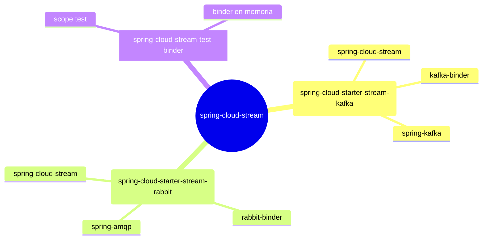

# 6.1 Spring Cloud Stream — Setup y dependencias

← [5.12 Testing / Verificación de Spring Cloud Gateway](sc-gateway-testing.md) | [Índice](README.md) | [6.2 Modelo de programación funcional](sc-stream-modelo-funcional.md) →

---

## Introducción

Spring Cloud Stream es el módulo de Spring Cloud que permite construir microservicios orientados a eventos conectados a brokers de mensajería (Kafka, RabbitMQ) sin acoplarse a las API nativas de cada broker. Existe porque la lógica de negocio no debería cambiar si el broker subyacente cambia; el framework abstrae la infraestructura de mensajería detrás de una capa de bindings configurables. Se necesita cuando un microservicio debe publicar o consumir mensajes de forma event-driven, escalable y resiliente.

## Estructura de dependencias

Spring Cloud Stream se compone de un artefacto core más un binder específico del broker. El artefacto core (`spring-cloud-stream`) proporciona el modelo de programación, la infraestructura de bindings y la autoconfiguración. Los binders son implementaciones intercambiables que conectan ese modelo al broker real.



## Configuración del BOM y dependencias Maven

El BOM (Bill of Materials) de Spring Cloud centraliza las versiones de todos los módulos, evitando conflictos. Con Spring Boot 3.x y Spring Cloud 2025.x la gestión es la siguiente.

```xml
<!-- pom.xml — gestión de versiones con BOM -->
<dependencyManagement>
    <dependencies>
        <dependency>
            <groupId>org.springframework.cloud</groupId>
            <artifactId>spring-cloud-dependencies</artifactId>
            <version>2025.0.0</version>
            <type>pom</type>
            <scope>import</scope>
        </dependency>
    </dependencies>
</dependencyManagement>

<dependencies>
    <!-- Opción A: usar Kafka como broker -->
    <dependency>
        <groupId>org.springframework.cloud</groupId>
        <artifactId>spring-cloud-starter-stream-kafka</artifactId>
    </dependency>

    <!-- Opción B: usar RabbitMQ como broker -->
    <dependency>
        <groupId>org.springframework.cloud</groupId>
        <artifactId>spring-cloud-starter-stream-rabbit</artifactId>
    </dependency>

    <!-- Dependencia de test (siempre scope test) -->
    <dependency>
        <groupId>org.springframework.cloud</groupId>
        <artifactId>spring-cloud-stream-test-binder</artifactId>
        <scope>test</scope>
    </dependency>
</dependencies>
```

## Ejemplo central — primer Consumer funcional

El siguiente ejemplo muestra la aplicación mínima con Spring Cloud Stream. No hay anotaciones propias de Stream: solo un bean `Consumer<String>` y configuración en `application.yml`. La autoconfiguración detecta el bean y genera el binding `processMessage-in-0` apuntando al topic/queue configurado.

```java
package com.example.stream;

import org.springframework.boot.SpringApplication;
import org.springframework.boot.autoconfigure.SpringBootApplication;
import org.springframework.context.annotation.Bean;
import java.util.function.Consumer;

@SpringBootApplication
public class StreamDemoApplication {

    public static void main(String[] args) {
        SpringApplication.run(StreamDemoApplication.class, args);
    }

    // Spring Cloud Stream detecta este bean y crea el binding 'processMessage-in-0'
    @Bean
    public Consumer<String> processMessage() {
        return message -> System.out.println("Received: " + message);
    }
}
```

```yaml
# application.yml
spring:
  cloud:
    stream:
      bindings:
        processMessage-in-0:
          destination: my-topic   # topic de Kafka o exchange/queue de RabbitMQ
          group: demo-group       # consumer group para competing consumers

# Si se usa Kafka:
      kafka:
        binder:
          brokers: localhost:9092
```

## Tabla de artefactos clave

La siguiente tabla resume los artefactos del ecosistema Spring Cloud Stream y su propósito:

| Artefacto | Propósito | Scope |
|-----------|-----------|-------|
| `spring-cloud-stream` | Core: bindings, autoconfiguración, modelo funcional | compile |
| `spring-cloud-starter-stream-kafka` | Core + Kafka binder | compile |
| `spring-cloud-starter-stream-rabbit` | Core + RabbitMQ binder | compile |
| `spring-cloud-stream-test-binder` | Binder en memoria para tests | test |
| `spring-cloud-schema-registry-client` | Soporte Avro + Schema Registry | compile (opcional) |

> [PREREQUISITO] Spring Cloud Stream 3.x/4.x requiere Spring Boot 3.x y Java 17+. El BOM `spring-cloud-dependencies` gestiona todas las versiones de los módulos Spring Cloud.

> [CONCEPTO] `spring-cloud-starter-stream-kafka` incluye transitivamente `spring-cloud-stream` y `spring-kafka`. No es necesario declarar el core por separado cuando se usa un starter de binder.

> [ADVERTENCIA] No incluir dos binders en el classpath sin configurar `spring.cloud.stream.defaultBinder`. Si Kafka y RabbitMQ están presentes simultáneamente, Spring Cloud Stream no puede elegir automáticamente y lanzará una excepción de autoconfiguración.

> [EXAMEN] La autoconfiguración de Spring Cloud Stream se activa mediante la presencia de un binder en el classpath y al menos un bean funcional (`Function`, `Consumer` o `Supplier`). No se requiere ninguna anotación habilitadora como `@EnableBinding` — esa anotación fue eliminada en Spring Cloud Stream 3.x. [LEGACY]

## Buenas y malas prácticas

**Buenas prácticas:**
- Usar siempre el BOM `spring-cloud-dependencies` para gestionar versiones de forma coherente.
- Incluir `spring-cloud-stream-test-binder` con scope `test` en todos los proyectos para facilitar tests sin broker real.
- Definir siempre `group` en los bindings consumer para garantizar durabilidad y competing consumers correctos.

**Malas prácticas:**
- Declarar `spring-cloud-stream` core y un starter de binder por separado (redundante, puede causar conflictos de versión).
- Usar `@EnableBinding`, `@Input`, `@Output` o `@StreamListener` — son API legacy eliminada en SC Stream 3.x. [LEGACY]
- Omitir el BOM y gestionar versiones manualmente.

## Verificación y práctica

1. ¿Qué artefacto Maven incluye automáticamente tanto el core de Spring Cloud Stream como el Kafka binder?

2. Al añadir `spring-cloud-starter-stream-kafka` y `spring-cloud-starter-stream-rabbit` al mismo classpath sin configuración adicional, ¿qué ocurre al arrancar la aplicación y cómo se resuelve?

3. ¿Para qué sirve la dependencia `spring-cloud-stream-test-binder` y por qué se declara con `scope test`?

4. ¿Qué bean funcional de Java estándar debe declararse para que Spring Cloud Stream cree un binding consumer con nombre `handleOrder-in-0`?

5. ¿Por qué la anotación `@EnableBinding` ya no existe en Spring Cloud Stream 4.x y qué la reemplaza?

---

← [5.12 Testing / Verificación de Spring Cloud Gateway](sc-gateway-testing.md) | [Índice](README.md) | [6.2 Modelo de programación funcional](sc-stream-modelo-funcional.md) →
