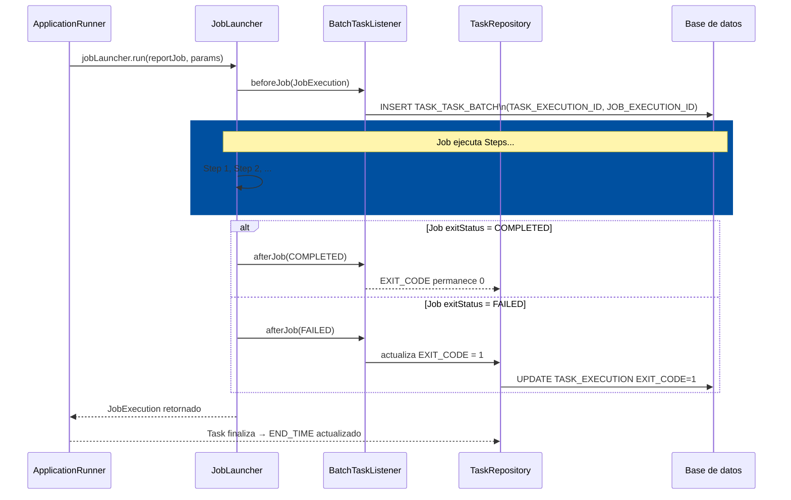
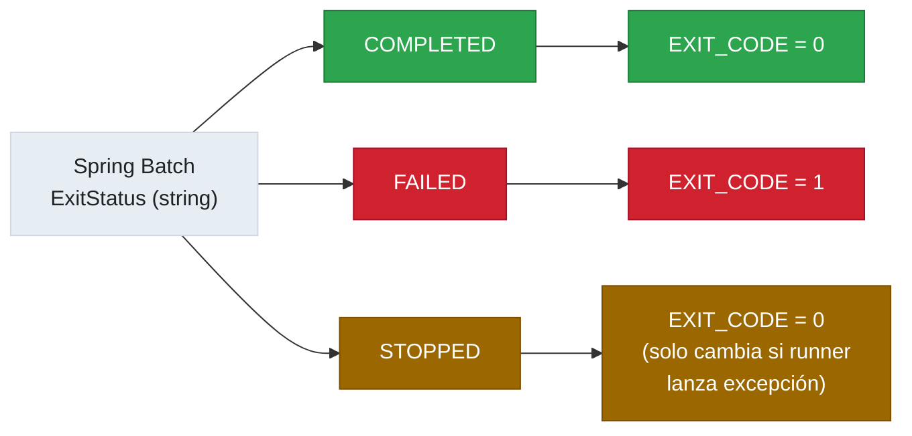

# 11.5 Spring Cloud Task — Integración con Spring Batch

← [11.4 ApplicationRunner, CommandLineRunner y Argumentos](sc-task-runners.md) | [Índice](README.md) | [11.6 Integración con Spring Cloud Data Flow](sc-task-data-flow.md) →

---

## Introducción

La combinación de Spring Cloud Task con Spring Batch es uno de los patrones de uso más frecuentes del módulo y un tema de alta relevancia en la certificación VMware. Spring Batch aporta el procesamiento estructurado por Jobs y Steps con semántica de checkpoint y restart; Spring Cloud Task añade el registro del ciclo de vida completo de la ejecución en `TASK_EXECUTION`. La integración se activa automáticamente mediante `BatchTaskListener` cuando ambas dependencias están presentes en el classpath.

> [CONCEPTO] Cuando se combinan `@EnableTask` y `@EnableBatchProcessing`, Spring Cloud Task crea la tabla `TASK_TASK_BATCH` que vincula cada `TaskExecution` con los `JobExecution` de Spring Batch que se ejecutaron dentro de esa Task.

## Arquitectura de la integración

La integración se basa en el `BatchTaskListener`, que actúa como puente entre los eventos del ciclo de vida de Spring Batch y el repositorio de Spring Cloud Task. El diagrama muestra cómo se relacionan los eventos.



*BatchTaskListener como puente: vincula JobExecution con TaskExecution en TASK_TASK_BATCH y sincroniza el EXIT_CODE según el resultado del Job.*

## Ejemplo central

El siguiente ejemplo muestra una aplicación que combina `@EnableTask` y `@EnableBatchProcessing`. La Task lanza un Job de Spring Batch, y el `BatchTaskListener` gestiona automáticamente el registro de la relación en `TASK_TASK_BATCH`. No es necesario implementar ningún listener adicional para que esto funcione.

```java
package com.example.task;

import org.springframework.batch.core.Job;
import org.springframework.batch.core.JobParameters;
import org.springframework.batch.core.JobParametersBuilder;
import org.springframework.batch.core.Step;
import org.springframework.batch.core.configuration.annotation.EnableBatchProcessing;
import org.springframework.batch.core.job.builder.JobBuilder;
import org.springframework.batch.core.launch.JobLauncher;
import org.springframework.batch.core.repository.JobRepository;
import org.springframework.batch.core.step.builder.StepBuilder;
import org.springframework.batch.repeat.RepeatStatus;
import org.springframework.boot.ApplicationArguments;
import org.springframework.boot.ApplicationRunner;
import org.springframework.boot.SpringApplication;
import org.springframework.boot.autoconfigure.SpringBootApplication;
import org.springframework.cloud.task.configuration.EnableTask;
import org.springframework.context.annotation.Bean;
import org.springframework.context.annotation.Configuration;
import org.springframework.stereotype.Component;
import org.springframework.transaction.PlatformTransactionManager;

@SpringBootApplication
@EnableTask               // activa Spring Cloud Task
@EnableBatchProcessing    // activa Spring Batch + auto-configura BatchTaskListener
public class BatchTaskApp {
    public static void main(String[] args) {
        SpringApplication.run(BatchTaskApp.class, args);
    }
}

@Configuration
class BatchJobConfig {

    @Bean
    public Job reportJob(JobRepository jobRepository, Step reportStep) {
        return new JobBuilder("reportJob", jobRepository)
            .start(reportStep)
            .build();
    }

    @Bean
    public Step reportStep(JobRepository jobRepository,
                           PlatformTransactionManager transactionManager) {
        return new StepBuilder("reportStep", jobRepository)
            .tasklet((contribution, chunkContext) -> {
                System.out.println("Generando reporte...");
                // Lógica de procesamiento
                return RepeatStatus.FINISHED;
            }, transactionManager)
            .build();
    }
}

// El ApplicationRunner lanza el Job de Batch
@Component
class BatchLauncherRunner implements ApplicationRunner {

    private final JobLauncher jobLauncher;
    private final Job reportJob;

    public BatchLauncherRunner(JobLauncher jobLauncher, Job reportJob) {
        this.jobLauncher = jobLauncher;
        this.reportJob = reportJob;
    }

    @Override
    public void run(ApplicationArguments args) throws Exception {
        JobParameters params = new JobParametersBuilder()
            .addLong("run.id", System.currentTimeMillis())
            .toJobParameters();

        // BatchTaskListener intercepta este lanzamiento automáticamente
        jobLauncher.run(reportJob, params);
    }
}
```

La dependencia Maven necesaria además de `spring-cloud-starter-task`:

```xml
<dependency>
    <groupId>org.springframework.cloud</groupId>
    <artifactId>spring-cloud-task-batch</artifactId>
</dependency>
<dependency>
    <groupId>org.springframework.boot</groupId>
    <artifactId>spring-boot-starter-batch</artifactId>
</dependency>
```

## Tabla de elementos clave

La integración introduce componentes y tablas adicionales que no existen en un uso standalone de Spring Cloud Task.

| Componente | Tipo | Descripción |
|---|---|---|
| `BatchTaskListener` | Listener | Se auto-configura con `spring-cloud-task-batch`; vincula `JobExecution` con `TaskExecution` |
| `TASK_TASK_BATCH` | Tabla BD | Join table: `TASK_EXECUTION_ID` ↔ `JOB_EXECUTION_ID` |
| `@EnableBatchProcessing` | Anotación | Activa Spring Batch y crea tablas `BATCH_*`; combinada con `@EnableTask` activa la integración |
| `JobExecution.exitStatus` | Entidad Batch | El estado final del Job; `FAILED` provoca `EXIT_CODE ≠ 0` en `TaskExecution` |
| `spring-cloud-task-batch` | Dependencia | Artifact que contiene `BatchTaskListener` y la auto-configuración de integración |

## Sincronización de exit codes

La sincronización entre el exitStatus de Spring Batch y el exitCode de Spring Cloud Task sigue reglas específicas que es importante conocer para el examen.

Spring Batch usa `ExitStatus` con strings como `COMPLETED`, `FAILED`, `STOPPED`. Spring Cloud Task usa enteros para `EXIT_CODE`. El `BatchTaskListener` realiza la traducción: si el `JobExecution.exitStatus` es `FAILED`, establece `EXIT_CODE = 1` en la `TaskExecution`. Para cualquier otro estado, el `EXIT_CODE` queda en 0 a menos que el runner lance una excepción.



*Traducción ExitStatus → EXIT_CODE: solo FAILED produce EXIT_CODE = 1; STOPPED no produce EXIT_CODE ≠ 0 automáticamente.*

```yaml
# Configuración necesaria cuando Batch y Task comparten la misma BD
# para evitar colisiones de prefijos de tabla
spring:
  cloud:
    task:
      table-prefix: TASK_     # tablas de Task: TASK_EXECUTION, TASK_EXECUTION_PARAMS
  batch:
    jdbc:
      table-prefix: BATCH_    # tablas de Batch: BATCH_JOB_EXECUTION, etc.
    initialize-schema: always  # crea schema de Batch automáticamente
```

## Buenas y malas prácticas

**Buenas prácticas:**
- Incluir siempre `spring-cloud-task-batch` explícitamente en el `pom.xml` en lugar de depender de transitive dependencies para activar `BatchTaskListener`.
- Configurar prefijos de tabla distintos para Task (`TASK_`) y Batch (`BATCH_`) incluso si por defecto no colisionan: documenta explícitamente la separación.
- Propagar las excepciones del `JobLauncher.run()` fuera del `ApplicationRunner.run()` para que `EXIT_CODE` refleje fallos de Batch.

**Malas prácticas:**
- Asumir que `@EnableTask` solo es suficiente para obtener la integración con Batch: se necesita también `spring-cloud-task-batch` en classpath y `@EnableBatchProcessing`.
- Ignorar el `EXIT_CODE` de la Task cuando el Job de Batch falla: puede resultar en Task marcada como exitosa aunque el Job haya fallado.
- Usar la misma tabla de BD para Task y Batch sin separación de prefijos en aplicaciones donde se usan ambos módulos con el mismo datasource.

> [ADVERTENCIA] Si `spring-cloud-task-batch` no está en el classpath, `BatchTaskListener` no se auto-configura aunque `@EnableTask` y `@EnableBatchProcessing` estén presentes. La tabla `TASK_TASK_BATCH` no se creará y no habrá vinculación entre ejecuciones.

> [PREREQUISITO] Spring Batch 5.x (Spring Boot 3.x) cambia la API: `@EnableBatchProcessing` activa auto-configuración diferente. Verificar compatibilidad de versiones entre `spring-cloud-task-batch` y `spring-batch-core`.

## Verificación y práctica

> [EXAMEN] **Pregunta 1:** ¿Qué listener vincula un Spring Batch Job con una TaskExecution y qué tabla de relación crea?

> [EXAMEN] **Pregunta 2:** ¿Qué dependencia Maven debe añadirse además de `spring-cloud-starter-task` y `spring-boot-starter-batch` para obtener la integración automática?

> [EXAMEN] **Pregunta 3:** Si un Job de Spring Batch termina con `ExitStatus.FAILED`, ¿qué valor de `EXIT_CODE` se registra en `TASK_EXECUTION`?

> [EXAMEN] **Pregunta 4:** ¿Cuáles son las columnas de la tabla `TASK_TASK_BATCH` y qué relación expresan?

> [EXAMEN] **Pregunta 5:** ¿Qué ocurre si se tiene `@EnableTask` y `@EnableBatchProcessing` pero no se incluye `spring-cloud-task-batch` en el classpath?

---

← [11.4 ApplicationRunner, CommandLineRunner y Argumentos](sc-task-runners.md) | [Índice](README.md) | [11.6 Integración con Spring Cloud Data Flow](sc-task-data-flow.md) →
