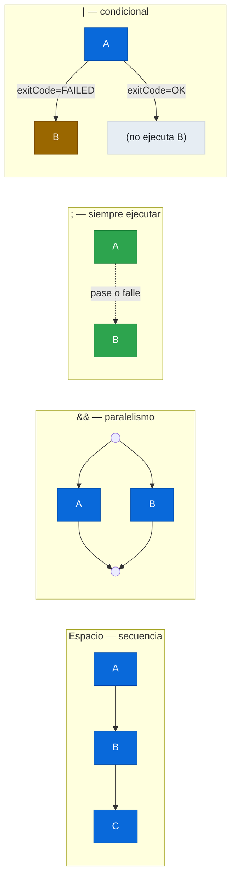
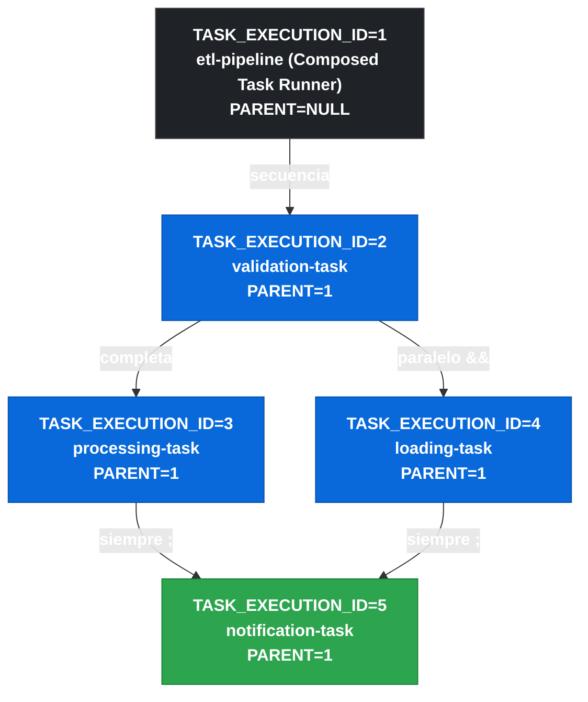

# 11.8 Spring Cloud Task — Composed Tasks

← [11.7 Task Events y TaskExecutionListener](sc-task-events.md) | [Índice](README.md) | [11.9 Testing](sc-task-testing.md) →

---

## Introducción

Las Composed Tasks permiten definir grafos de ejecución de tareas donde múltiples Tasks individuales se encadenan en flujos secuenciales, paralelos o condicionales. En lugar de implementar la orquestación manualmente con código, el DSL de Composed Tasks expresa el grafo de ejecución de forma declarativa. El Composed Task Runner actúa como orquestador, lanzando cada sub-tarea vía Spring Cloud Data Flow y esperando su resultado antes de continuar con la siguiente. Cada sub-tarea produce su propia `TaskExecution` independiente, manteniendo trazabilidad completa.

> [CONCEPTO] Una Composed Task es una Task especial que actúa como orquestador: lanza otras Tasks (sub-tareas) vía SCDF siguiendo un grafo definido en DSL, y registra el resultado de cada una como `TaskExecution` independiente con `PARENT_EXECUTION_ID` apuntando al padre.

## DSL de Composed Tasks

El DSL de Composed Tasks usa operadores específicos para expresar relaciones de flujo. Los operadores son los mismos que se usan en la interfaz gráfica de SCDF y en la API REST.



*Cuatro operadores DSL de Composed Tasks: secuencia, paralelismo, siempre-ejecutar y condicional-por-exit-code.*

## Ejemplo central

El siguiente ejemplo muestra cómo registrar y lanzar una Composed Task en SCDF usando la API REST. La Composed Task define un pipeline donde la validación se ejecuta primero, luego el procesamiento y la carga se ejecutan en paralelo, y finalmente la notificación se ejecuta siempre.

```bash
# 1. Registrar las Tasks individuales en SCDF
curl -X POST http://localhost:9393/apps/task/validation-task \
  -d "uri=maven://com.example:validation-task:1.0.0"

curl -X POST http://localhost:9393/apps/task/processing-task \
  -d "uri=maven://com.example:processing-task:1.0.0"

curl -X POST http://localhost:9393/apps/task/loading-task \
  -d "uri=maven://com.example:loading-task:1.0.0"

curl -X POST http://localhost:9393/apps/task/notification-task \
  -d "uri=maven://com.example:notification-task:1.0.0"

# 2. Registrar la app Composed Task Runner
curl -X POST http://localhost:9393/apps/task/composed-task-runner \
  -d "uri=maven://org.springframework.cloud.task.app:composed-task-runner:latest"

# 3. Crear la Composed Task definition con DSL
# Pipeline: validar → (procesar && cargar) → notificar siempre
curl -X POST http://localhost:9393/tasks/definitions \
  -d "name=etl-pipeline&definition=validation-task 'processing-task && loading-task' ; notification-task"

# 4. Lanzar la Composed Task
curl -X POST "http://localhost:9393/tasks/executions" \
  -d "name=etl-pipeline&arguments=--spring.cloud.task.name=etl-pipeline"

# 5. Consultar las TaskExecutions generadas (una por sub-tarea + una para el runner)
curl "http://localhost:9393/tasks/executions?name=etl-pipeline"
```

El `pom.xml` del Composed Task Runner (artefacto separado proporcionado por Spring Cloud):

```xml
<!-- No se desarrolla: se registra en SCDF el artefacto pre-construido -->
<!-- El Composed Task Runner actúa como la "Task padre" que orquesta las sub-tareas -->
<dependency>
    <groupId>org.springframework.cloud.task.app</groupId>
    <artifactId>composed-task-runner</artifactId>
    <version>${spring-cloud-task-app.version}</version>
</dependency>
```

Una aplicación propia que actúa como sub-tarea no necesita ninguna dependencia adicional:

```java
package com.example.task;

import org.springframework.boot.ApplicationArguments;
import org.springframework.boot.ApplicationRunner;
import org.springframework.boot.SpringApplication;
import org.springframework.boot.autoconfigure.SpringBootApplication;
import org.springframework.cloud.task.configuration.EnableTask;
import org.springframework.stereotype.Component;

@SpringBootApplication
@EnableTask
public class ValidationTaskApp {
    public static void main(String[] args) {
        SpringApplication.run(ValidationTaskApp.class, args);
    }
}

@Component
class ValidationRunner implements ApplicationRunner {
    @Override
    public void run(ApplicationArguments args) throws Exception {
        System.out.println("Validando datos de entrada...");
        // Si falla: EXIT_CODE != 0 → el Composed Task Runner detiene la secuencia
        // (o ejecuta la rama condicional según el DSL)
    }
}
```

## Tabla de elementos clave

Los operadores del DSL y los componentes de Composed Tasks tienen roles diferenciados que es importante distinguir.

| Elemento | Tipo | Descripción |
|---|---|---|
| `A B` (espacio) | Operador DSL | Secuencia: B se ejecuta después de que A complete con éxito |
| `A && B` | Operador DSL | Split: A y B se ejecutan en paralelo |
| `<A> \| <B>` | Operador DSL | Condicional: B se ejecuta si A falla (exit code no 0) |
| `A ; B` | Operador DSL | B se ejecuta siempre, independientemente del resultado de A |
| Composed Task Runner | Orquestador | Aplicación Spring Boot especial que lanza sub-tareas vía SCDF REST API |
| `PARENT_EXECUTION_ID` | Campo BD | En cada sub-tarea, apunta al `TASK_EXECUTION_ID` del Composed Task Runner |
| `spring-cloud-starter-task-composed-task-runner` | Dependencia | Artifact del Composed Task Runner |

## Relación de TaskExecutions en Composed Tasks

Cuando se ejecuta una Composed Task, se crean múltiples `TaskExecution` en la base de datos. La relación padre-hijo se establece mediante `PARENT_EXECUTION_ID`.



*Relación padre-hijo en TASK_EXECUTION: cada sub-tarea tiene PARENT_EXECUTION_ID apuntando al ID del Composed Task Runner.*

> [ADVERTENCIA] Las Composed Tasks requieren SCDF para funcionar: el Composed Task Runner necesita llamar a la API REST de SCDF para lanzar cada sub-tarea. No es posible ejecutar Composed Tasks sin SCDF.

## Buenas y malas prácticas

**Buenas prácticas:**
- Diseñar cada sub-tarea como una unidad independiente que pueda ejecutarse por separado: facilita testing y reutilización.
- Usar `; (siempre ejecutar)` para tareas de notificación y limpieza que deben ejecutarse independientemente del resultado de las tareas anteriores.
- Verificar el `PARENT_EXECUTION_ID` en `TASK_EXECUTION` para trazar la jerarquía completa de ejecución de una Composed Task.

**Malas prácticas:**
- Crear Composed Tasks con demasiada profundidad de anidamiento: cada nivel añade latencia por las llamadas REST a SCDF entre sub-tareas.
- Intentar implementar Composed Tasks sin SCDF: el Composed Task Runner depende de la API REST de SCDF y no funciona de forma autónoma.
- Usar `&&` (paralelo) para tareas que dependen implícitamente una de otra: el paralelismo real requiere que las tareas sean independientes en datos y recursos.

> [PREREQUISITO] Para usar Composed Tasks se necesita: (1) SCDF Server desplegado y accesible, (2) todas las sub-tareas registradas en SCDF como aplicaciones, (3) el Composed Task Runner registrado en SCDF, (4) datasource compartido entre SCDF y todas las Tasks.

## Verificación y práctica

> [EXAMEN] **Pregunta 1:** ¿Qué operador DSL de Composed Tasks se usa para ejecutar dos tareas en paralelo?

> [EXAMEN] **Pregunta 2:** ¿Qué operador garantiza que una tarea se ejecute siempre, independientemente del resultado de la tarea anterior?

> [EXAMEN] **Pregunta 3:** ¿Qué campo de la tabla `TASK_EXECUTION` vincula las sub-tareas con la Composed Task padre?

> [EXAMEN] **Pregunta 4:** ¿Es posible ejecutar una Composed Task sin Spring Cloud Data Flow? Justifica la respuesta.

> [EXAMEN] **Pregunta 5:** Si la sub-tarea A en la secuencia `A B C` falla con EXIT_CODE=1, ¿qué ocurre con las sub-tareas B y C?

---

← [11.7 Task Events y TaskExecutionListener](sc-task-events.md) | [Índice](README.md) | [11.9 Testing](sc-task-testing.md) →
