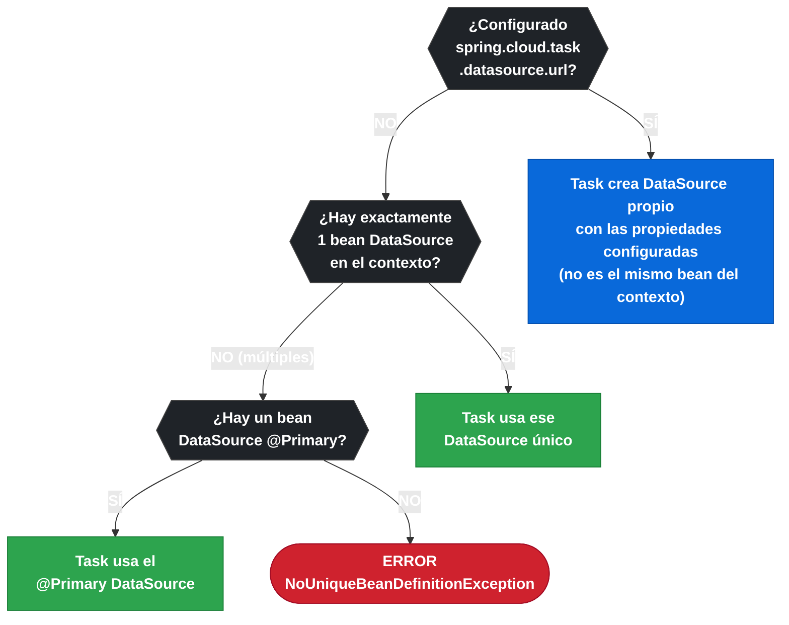

# 11.3 Spring Cloud Task — Configuración y Datasource

← [11.2 TaskExecution y Persistencia](sc-task-execution-bd.md) | [Índice](README.md) | [11.4 ApplicationRunner, CommandLineRunner y Argumentos](sc-task-runners.md) →

---

## Introducción

Spring Cloud Task necesita un datasource JDBC para persistir las ejecuciones. En aplicaciones sencillas con un único datasource, la configuración es automática. Sin embargo, en aplicaciones que utilizan múltiples datasources (por ejemplo, uno para negocio y otro para Task), es necesario indicar explícitamente cuál datasource debe usar el módulo Task. Las propiedades `spring.cloud.task.*` ofrecen control granular sobre el prefijo de tablas, el schema y el comportamiento de instancia única.

> [CONCEPTO] Spring Cloud Task utiliza por defecto el datasource marcado con `@Primary` en el contexto. Si ninguno es `@Primary` o existen múltiples beans de datasource sin esa marca, es necesario configurar `spring.cloud.task.datasource.*` explícitamente.

## Propiedades de configuración

El conjunto completo de propiedades del namespace `spring.cloud.task` controla todos los aspectos del comportamiento del módulo. La siguiente tabla muestra cada propiedad con su valor por defecto y descripción.

| Propiedad | Valor por defecto | Descripción |
|---|---|---|
| `spring.cloud.task.initialize-enabled` | `true` | Si se crea el schema automáticamente al arrancar |
| `spring.cloud.task.table-prefix` | `TASK_` | Prefijo de las tablas (`TASK_EXECUTION`, `TASK_EXECUTION_PARAMS`) |
| `spring.cloud.task.schema-name` | (vacío) | Schema de base de datos a usar (ej: `myschema`) |
| `spring.cloud.task.close-context-enabled` | `false` | Si se cierra el ApplicationContext al terminar la tarea |
| `spring.cloud.task.single-instance-enabled` | `false` | Si se bloquea una segunda ejecución con el mismo nombre |
| `spring.cloud.task.single-instance-lock-check-time` | `500` | Milisegundos entre comprobaciones del bloqueo de instancia única |
| `spring.cloud.task.single-instance-lock-ttl` | (ilimitado) | TTL del bloqueo de instancia única en milisegundos |
| `spring.cloud.task.name` | (nombre del artefacto) | Nombre explícito de la tarea |
| `spring.cloud.task.datasource.url` | (del datasource principal) | URL del datasource dedicado a Task |
| `spring.cloud.task.datasource.username` | — | Usuario del datasource de Task |
| `spring.cloud.task.datasource.password` | — | Contraseña del datasource de Task |
| `spring.cloud.task.datasource.driver-class-name` | — | Driver JDBC del datasource de Task |

## Ejemplo central

El siguiente ejemplo muestra una aplicación con dos datasources: uno para la lógica de negocio y otro dedicado a las tablas de Spring Cloud Task. Se usan las propiedades `spring.cloud.task.datasource.*` para evitar ambigüedad en la resolución del datasource.

```java
package com.example.task;

import org.springframework.boot.ApplicationArguments;
import org.springframework.boot.ApplicationRunner;
import org.springframework.boot.SpringApplication;
import org.springframework.boot.autoconfigure.SpringBootApplication;
import org.springframework.boot.context.properties.ConfigurationProperties;
import org.springframework.boot.jdbc.DataSourceBuilder;
import org.springframework.cloud.task.configuration.EnableTask;
import org.springframework.context.annotation.Bean;
import org.springframework.context.annotation.Configuration;
import org.springframework.context.annotation.Primary;
import org.springframework.stereotype.Component;
import javax.sql.DataSource;

@SpringBootApplication
@EnableTask
public class MultiDatasourceTaskApp {
    public static void main(String[] args) {
        SpringApplication.run(MultiDatasourceTaskApp.class, args);
    }
}

@Configuration
class DatasourceConfig {

    // Datasource principal para lógica de negocio
    @Bean
    @Primary
    @ConfigurationProperties(prefix = "spring.datasource")
    public DataSource businessDataSource() {
        return DataSourceBuilder.create().build();
    }

    // Datasource secundario para Spring Cloud Task
    // NO @Primary — Task lo resuelve por spring.cloud.task.datasource.*
    @Bean
    @ConfigurationProperties(prefix = "task.datasource")
    public DataSource taskDataSource() {
        return DataSourceBuilder.create().build();
    }
}

@Component
class BusinessRunner implements ApplicationRunner {
    @Override
    public void run(ApplicationArguments args) throws Exception {
        System.out.println("Ejecutando lógica de negocio sobre datasource primario");
    }
}
```

La configuración en `application.yml` para el escenario multi-datasource:

```yaml
spring:
  application:
    name: multi-ds-task
  datasource:
    url: jdbc:postgresql://localhost:5432/business_db
    username: business_user
    password: secret
    driver-class-name: org.postgresql.Driver
  cloud:
    task:
      name: nightly-etl
      table-prefix: SCT_        # evita colisión con prefijo BATCH_ de Spring Batch
      initialize-enabled: true
      single-instance-enabled: true  # bloquea segunda ejecución simultánea
      close-context-enabled: true    # cierra contexto al terminar
      datasource:
        url: jdbc:postgresql://localhost:5432/task_db
        username: task_user
        password: secret
        driver-class-name: org.postgresql.Driver

# Datasource secundario para el bean taskDataSource()
task:
  datasource:
    url: jdbc:postgresql://localhost:5432/task_db
    username: task_user
    password: secret
    driver-class-name: org.postgresql.Driver
```

## Escenarios de resolución de datasource

Spring Cloud Task sigue un orden de resolución para encontrar el datasource donde persistir. Conocer este orden evita errores de configuración habituales.

El siguiente diagrama muestra la lógica de resolución:



*Orden de resolución del datasource: la propiedad explícita spring.cloud.task.datasource.url tiene prioridad absoluta sobre la detección automática.*

## Propiedad close-context-enabled

La propiedad `close-context-enabled` merece atención especial. Por defecto es `false`, lo que significa que el ApplicationContext no se cierra automáticamente al terminar los runners. En aplicaciones Spring Boot estándar, la JVM se cierra cuando no quedan threads no-daemon activos. Sin embargo, en entornos embebidos o cuando se tienen listeners de contexto, es necesario forzar el cierre.

Cuando se establece `close-context-enabled: true`, Spring Cloud Task invoca `ApplicationContext.close()` al terminar la ejecución de todos los runners, lo que garantiza que los beans `@PreDestroy` se ejecuten y los recursos se liberen correctamente.

## Buenas y malas prácticas

**Buenas prácticas:**
- Usar `spring.cloud.task.table-prefix` con un prefijo diferente de `TASK_` cuando la misma base de datos también contiene tablas de Spring Batch (que usan prefijo `BATCH_`): así se evitan confusiones aunque no hay colisión directa.
- Establecer `single-instance-enabled: true` en tareas que no deben ejecutarse concurrentemente (como ETL que bloquean tablas).
- Configurar `close-context-enabled: true` en producción para garantizar liberación de recursos.

**Malas prácticas:**
- Usar camelCase en propiedades: `closeContextEnabled` no es reconocido; la forma correcta es `close-context-enabled`.
- Confiar en que `@Primary` siempre resuelve el datasource correcto en entornos con auto-configuración de múltiples datasources: verificar explícitamente con `spring.cloud.task.datasource.*`.
- Dejar `initialize-enabled: true` en producción con Flyway/Liquibase activos: puede crear conflictos de schema o intentos de crear tablas ya existentes.

> [ADVERTENCIA] Las propiedades deben estar en kebab-case: `single-instance-enabled`, `close-context-enabled`, `table-prefix`. Usar camelCase no produce error pero las propiedades son ignoradas silenciosamente.

> [PREREQUISITO] Cuando se usa `spring.cloud.task.datasource.*`, Spring Cloud Task crea un DataSource propio usando `DataSourceBuilder`. Este DataSource NO es el mismo bean que el del contexto Spring: no se puede inyectar como `@Autowired DataSource` y obtener el de Task.

## Verificación y práctica

> [EXAMEN] **Pregunta 1:** ¿Qué propiedad en kebab-case impide que una Task se ejecute si ya hay otra instancia en ejecución con el mismo nombre?

> [EXAMEN] **Pregunta 2:** Una aplicación tiene dos `DataSource` beans sin `@Primary`. ¿Qué debe configurarse para que Spring Cloud Task persista en el datasource correcto?

> [EXAMEN] **Pregunta 3:** ¿Cuál es el valor por defecto del prefijo de tablas de Spring Cloud Task y cómo se cambia?

> [EXAMEN] **Pregunta 4:** ¿Qué efecto tiene `close-context-enabled: true` al finalizar la Task?

> [EXAMEN] **Pregunta 5:** ¿Qué propiedad desactiva la creación automática del schema de Spring Cloud Task y cuándo es necesario desactivarla?

---

← [11.2 TaskExecution y Persistencia](sc-task-execution-bd.md) | [Índice](README.md) | [11.4 ApplicationRunner, CommandLineRunner y Argumentos](sc-task-runners.md) →
