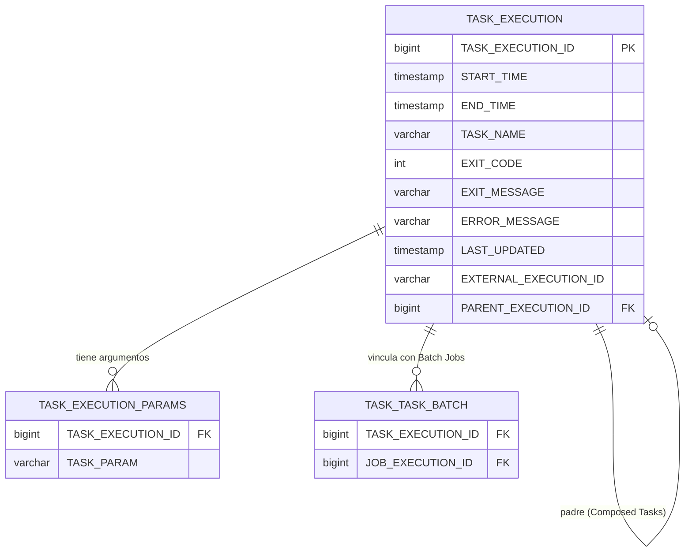
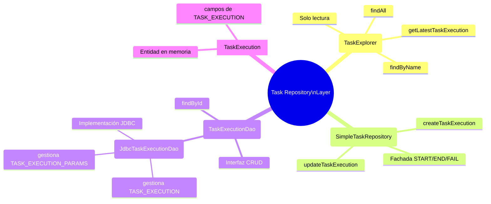

# 11.2 Spring Cloud Task — TaskExecution y Persistencia en Base de Datos

← [11.1 Fundamentos y Ciclo de Vida](sc-task-fundamentos.md) | [Índice](README.md) | [11.3 Configuración y Datasource](sc-task-configuracion.md) →

---

## Introducción

Spring Cloud Task persiste cada ejecución en una base de datos relacional para ofrecer auditabilidad y trazabilidad. La entidad central es `TaskExecution`, que representa una ejecución concreta de una tarea con todos sus metadatos: cuándo arrancó, cuándo terminó, con qué resultado y con qué argumentos. Entender esta entidad y su schema es fundamental tanto para el desarrollo como para la certificación VMware Spring Professional.

> [CONCEPTO] `TaskExecution` es la entidad principal de persistencia de Spring Cloud Task. No confundir con conceptos de Spring Batch como `JobExecution` o `StepExecution`, que son entidades de un módulo diferente.

## Schema de base de datos

Spring Cloud Task crea automáticamente el schema al arrancar si la propiedad `spring.cloud.task.initialize-enabled` está en `true` (valor por defecto). El schema se compone de tres tablas relacionadas entre sí.



*Schema de Spring Cloud Task: TASK_EXECUTION es la tabla central; TASK_EXECUTION_PARAMS almacena argumentos y TASK_TASK_BATCH vincula con Spring Batch (solo con spring-cloud-task-batch).*

## Ejemplo central

El siguiente ejemplo muestra cómo acceder programáticamente a las entidades de persistencia usando `TaskExplorer` y `TaskExecutionDao`. También ilustra cómo la entidad `TaskExecution` se construye en memoria antes de ser persistida.

```java
package com.example.task;

import org.springframework.batch.core.ExitStatus;
import org.springframework.boot.ApplicationArguments;
import org.springframework.boot.ApplicationRunner;
import org.springframework.boot.SpringApplication;
import org.springframework.boot.autoconfigure.SpringBootApplication;
import org.springframework.cloud.task.configuration.EnableTask;
import org.springframework.cloud.task.repository.TaskExecution;
import org.springframework.cloud.task.repository.TaskExplorer;
import org.springframework.stereotype.Component;
import java.util.List;

@SpringBootApplication
@EnableTask
public class TaskPersistenceApp {
    public static void main(String[] args) {
        SpringApplication.run(TaskPersistenceApp.class, args);
    }
}

@Component
class TaskInfoRunner implements ApplicationRunner {

    private final TaskExplorer taskExplorer;

    public TaskInfoRunner(TaskExplorer taskExplorer) {
        this.taskExplorer = taskExplorer;
    }

    @Override
    public void run(ApplicationArguments args) throws Exception {
        // Consulta todas las ejecuciones registradas
        List<TaskExecution> executions = taskExplorer.findAll(
            org.springframework.data.domain.PageRequest.of(0, 10)
        ).getContent();

        executions.forEach(exec -> {
            System.out.printf(
                "ID=%d | Name=%s | Start=%s | ExitCode=%d%n",
                exec.getExecutionId(),
                exec.getTaskName(),
                exec.getStartTime(),
                exec.getExitCode()
            );
        });

        // Consulta la última ejecución de una tarea específica
        TaskExecution latest = taskExplorer
            .getLatestTaskExecutionForTaskName("my-report-task");
        if (latest != null) {
            System.out.println("Última ejecución exitosa: " +
                (latest.getExitCode() == 0 ? "SÍ" : "NO"));
        }
    }
}
```

La dependencia Maven para tener `TaskExplorer` disponible es:

```xml
<dependency>
    <groupId>org.springframework.cloud</groupId>
    <artifactId>spring-cloud-starter-task</artifactId>
</dependency>
<dependency>
    <groupId>org.springframework.boot</groupId>
    <artifactId>spring-boot-starter-jdbc</artifactId>
</dependency>
```

## Tabla de elementos clave

Los componentes DAO del módulo forman una jerarquía clara donde `SimpleTaskRepository` actúa como fachada de alto nivel y delega las operaciones CRUD en `JdbcTaskExecutionDao`.



*Jerarquía de componentes DAO: SimpleTaskRepository orquesta el ciclo de vida; TaskExplorer es la API de solo lectura para consultas.*

| Componente | Rol | Descripción |
|---|---|---|
| `TaskExecution` | Entidad | Objeto Java con todos los campos de `TASK_EXECUTION`; se pasa entre componentes |
| `TaskExecutionDao` | Interfaz DAO | Define operaciones CRUD: `createTaskExecution`, `updateTaskExecution`, `findById` |
| `JdbcTaskExecutionDao` | Implementación | Implementación por defecto vía JDBC; gestiona `TASK_EXECUTION` y `TASK_EXECUTION_PARAMS` |
| `SimpleTaskRepository` | Repositorio | Fachada que usa `TaskExecutionDao`; orquesta el ciclo completo START/END/FAIL |
| `TaskExplorer` | Query API | Solo lectura; expone métodos `findAll`, `findByName`, `getLatestTaskExecution*` |

## Campos de TaskExecution en detalle

La clase `TaskExecution` encapsula todos los datos de una ejecución. Cada campo tiene un rol específico en la trazabilidad.

| Campo Java | Columna BD | Significado |
|---|---|---|
| `executionId` | `TASK_EXECUTION_ID` | PK autoincremental |
| `exitCode` | `EXIT_CODE` | 0 éxito, 1 error genérico, o valor de `ExitCodeExceptionMapper` |
| `taskName` | `TASK_NAME` | Resuelto por `SimpleTaskNameResolver` |
| `startTime` | `START_TIME` | Se escribe al inicio antes de ejecutar runners |
| `endTime` | `END_TIME` | Se escribe al finalizar; null si la tarea sigue en curso |
| `exitMessage` | `EXIT_MESSAGE` | Mensaje personalizado que puede establecer el runner |
| `errorMessage` | `ERROR_MESSAGE` | Stacktrace de la excepción no capturada |
| `externalExecutionId` | `EXTERNAL_EXECUTION_ID` | ID externo (ID de pod K8s, ID de job CF) |
| `parentExecutionId` | `PARENT_EXECUTION_ID` | ID de la Task padre en Composed Tasks |
| `arguments` | `TASK_EXECUTION_PARAMS` | Lista de strings; cada uno es una fila en la tabla de parámetros |

## Buenas y malas prácticas

**Buenas prácticas:**
- Usar `TaskExplorer` para consultas de solo lectura en lugar de acceder directamente a `TaskExecutionDao` desde código de aplicación.
- Configurar `spring.cloud.task.initialize-enabled=false` en producción si el schema ya existe y está gestionado por Liquibase o Flyway.
- Siempre verificar el valor de `EXIT_CODE` para determinar si una tarea terminó con éxito, no solo la ausencia de excepción en logs.

**Malas prácticas:**
- Acceder directamente a las tablas `TASK_EXECUTION` con queries SQL propias en lugar de usar `TaskExplorer`.
- Asumir que `END_TIME` no nulo implica éxito: también puede ser un error con `EXIT_CODE ≠ 0`.
- Deshabilitar `initialize-enabled` en desarrollo sin tener el schema creado manualmente.

> [ADVERTENCIA] Si se desactiva `spring.cloud.task.initialize-enabled=false` sin crear el schema manualmente, la aplicación fallará al arrancar con error de tabla no encontrada.

> [PREREQUISITO] Para que `TASK_TASK_BATCH` se cree, debe estar presente la dependencia `spring-cloud-task-batch` Y haberse ejecutado al menos una Task con `@EnableBatchProcessing` activo.

## Verificación y práctica

> [EXAMEN] **Pregunta 1:** ¿Cuáles son las columnas obligatorias de la tabla `TASK_EXECUTION` y cuál es la clave primaria?

> [EXAMEN] **Pregunta 2:** ¿Qué diferencia hay entre `TaskExecutionDao` y `TaskExplorer`? ¿Cuándo usarías cada uno?

> [EXAMEN] **Pregunta 3:** ¿Qué columna de `TASK_EXECUTION` se usa para enlazar tareas padre-hijo en Composed Tasks?

> [EXAMEN] **Pregunta 4:** ¿En qué tabla se almacenan los argumentos de línea de comandos de una Task y cuál es su estructura?

> [EXAMEN] **Pregunta 5:** ¿Qué propiedad controla si Spring Cloud Task crea automáticamente el schema al arrancar y cuál es su valor por defecto?

---

← [11.1 Fundamentos y Ciclo de Vida](sc-task-fundamentos.md) | [Índice](README.md) | [11.3 Configuración y Datasource](sc-task-configuracion.md) →
