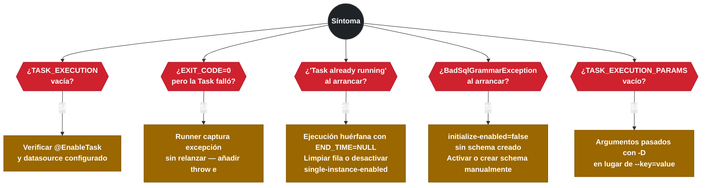

# 11.10 Spring Cloud Task — Troubleshooting

← [11.9 Testing](sc-task-testing.md) | [Índice](README.md) | [12.1 Spring Cloud Function — Modelo de programación funcional](sc-function-modelo-programacion.md) →

---

## Introducción

Los problemas más frecuentes con Spring Cloud Task se agrupan en cinco categorías: fallos de persistencia (la Task no registra en base de datos), control de instancias concurrentes, conflictos de schema entre Task y Batch, códigos de salida incorrectos y mapeo de excepciones a exit codes específicos. Este nodo cubre cada síntoma con su causa raíz y la solución concreta, en formato de consulta rápida para diagnóstico.

> [ADVERTENCIA] El 80% de los problemas con Spring Cloud Task se debe a dos causas: datasource no configurado (la tarea arranca pero no persiste) o excepción capturada silenciosamente en el runner (la tarea falla pero registra `EXIT_CODE=0`).

## Problema 1: La Task no registra en base de datos

**Síntoma:** La aplicación se ejecuta correctamente pero la tabla `TASK_EXECUTION` no tiene ninguna fila nueva, o la aplicación falla con `NoSuchTableException` o `BadSqlGrammarException`.

**Causas posibles:**

```
Causa 1: Falta @EnableTask en la clase @SpringBootApplication
  → La Task se ejecuta como Spring Boot normal sin registro

Causa 2: No hay DataSource configurado
  → spring-cloud-starter-task necesita JDBC; sin datasource, el contexto falla al arrancar

Causa 3: spring.cloud.task.initialize-enabled=false y el schema no existe
  → La Task arranca pero falla al intentar INSERT en TASK_EXECUTION

Causa 4: El schema existe en otro schema/prefijo diferente al configurado
  → Las queries usan TASK_ pero las tablas se llaman SCT_ u otro prefijo
```

**Solución:**

```yaml
# application.yml — configuración mínima
spring:
  datasource:
    url: jdbc:h2:mem:testdb;DB_CLOSE_DELAY=-1
    driver-class-name: org.h2.Driver
  cloud:
    task:
      initialize-enabled: true  # valor por defecto; verificar que no esté en false
      table-prefix: TASK_       # debe coincidir con el schema existente
```

```java
// Verificar que @EnableTask está presente
@SpringBootApplication
@EnableTask  // ← obligatorio
public class MyTaskApp { ... }
```

## Problema 2: Segunda ejecución bloqueada inesperadamente

**Síntoma:** La Task falla al arrancar con mensaje similar a: `Task with name 'my-task' is already running`.

**Causa:** `spring.cloud.task.single-instance-enabled=true` está activo y hay otra ejecución con el mismo nombre que no ha registrado `END_TIME` (porque terminó de forma anormal sin actualizar `TASK_EXECUTION`).

**Solución:**

```yaml
spring:
  cloud:
    task:
      single-instance-enabled: false  # desactivar si no se necesita control de concurrencia
```

Si el bloqueo es legítimo pero quedó huérfano por una JVM que murió sin limpiar:

```sql
-- Limpiar ejecución huérfana que bloquea el arranque
UPDATE TASK_EXECUTION
SET END_TIME = NOW(), EXIT_CODE = 1, EXIT_MESSAGE = 'Killed externally'
WHERE TASK_NAME = 'my-task'
  AND END_TIME IS NULL;
```

> [ADVERTENCIA] No usar `single-instance-enabled=true` sin un mecanismo de limpieza de ejecuciones huérfanas: si la JVM es terminada con `kill -9`, la fila en `TASK_EXECUTION` no se actualiza y el bloqueo queda indefinidamente activo.

## Problema 3: Conflicto de schema con Spring Batch

**Síntoma:** Al usar `@EnableTask` y `@EnableBatchProcessing` juntos, se producen errores como `Table 'BATCH_JOB_EXECUTION' not found` o `Table 'TASK_EXECUTION' already exists` al arrancar.

**Causa:** Spring Batch y Spring Cloud Task pueden intentar crear sus schemas simultáneamente, o los prefijos de tabla pueden causar confusión cuando ambos están en la misma base de datos.

**Solución:**

```yaml
spring:
  cloud:
    task:
      initialize-enabled: true   # Task crea TASK_EXECUTION, TASK_EXECUTION_PARAMS
      table-prefix: TASK_         # prefijo explícito para tablas de Task
  batch:
    jdbc:
      initialize-schema: always   # Batch crea BATCH_JOB_EXECUTION, etc.
      table-prefix: BATCH_        # prefijo explícito para tablas de Batch
```

```xml
<!-- Asegurarse de incluir spring-cloud-task-batch para la integración -->
<dependency>
    <groupId>org.springframework.cloud</groupId>
    <artifactId>spring-cloud-task-batch</artifactId>
</dependency>
```

## Problema 4: EXIT_CODE siempre 0 aunque la Task falle

**Síntoma:** La Task falla en la lógica de negocio pero `TASK_EXECUTION.EXIT_CODE` siempre muestra 0. Los logs muestran errores pero la base de datos indica éxito.

**Causa:** El `ApplicationRunner.run()` está capturando la excepción con `try-catch` genérico y no la relanza. Spring Cloud Task solo detecta el fallo si la excepción llega al `TaskLifecycleListener`.

```java
// INCORRECTO — excepción capturada silenciosamente
@Override
public void run(ApplicationArguments args) throws Exception {
    try {
        processData();
    } catch (Exception e) {
        log.error("Error procesando datos", e);
        // EXIT_CODE = 0 aunque haya fallado
    }
}

// CORRECTO — excepción propagada para que Task la registre
@Override
public void run(ApplicationArguments args) throws Exception {
    try {
        processData();
    } catch (Exception e) {
        log.error("Error procesando datos", e);
        throw e;  // relanzar para que EXIT_CODE != 0
    }
}
```

## Problema 5: TASK_EXECUTION_PARAMS vacío aunque se pasaron argumentos

**Síntoma:** La tabla `TASK_EXECUTION_PARAMS` no tiene filas para una ejecución aunque la Task se lanzó con argumentos.

**Causas posibles:**

```
Causa 1: Los argumentos no se pasan como argumentos de Spring Boot
  → Se pasan como variables de entorno o system properties en lugar de args[]: 
     java -Ddate=2025-01-01 -jar app.jar   (NO se registran en TASK_EXECUTION_PARAMS)
     java -jar app.jar --date=2025-01-01   (SÍ se registran)

Causa 2: El ApplicationRunner no recibe los args directamente
  → El runner wrapper consume los args antes de pasarlos al runner de la Task
```

**Solución:** Siempre pasar argumentos como argumentos de línea de comandos con `--key=value`:

```bash
# Correcto: argumentos registrados en TASK_EXECUTION_PARAMS
java -jar my-task.jar --spring.cloud.task.name=etl --report.date=2025-01-01

# Incorrecto: NO quedan en TASK_EXECUTION_PARAMS
java -DREPORT_DATE=2025-01-01 -jar my-task.jar
```

## Problema 6: Mapear tipos de excepción a EXIT_CODE específicos

**Síntoma:** Todas las excepciones resultan en `EXIT_CODE=1` aunque se necesita distinguir entre error de validación (2), error de negocio (3) y error de infraestructura (4).

**Solución:** Implementar `ExitCodeExceptionMapper`:

```java
package com.example.task;

import org.springframework.boot.ExitCodeExceptionMapper;
import org.springframework.stereotype.Component;

@Component
public class TaskExitCodeMapper implements ExitCodeExceptionMapper {

    @Override
    public int getExitCode(Throwable exception) {
        if (exception.getCause() instanceof IllegalArgumentException) {
            return 2;  // Error de validación de argumentos
        }
        if (exception.getCause() instanceof java.sql.SQLException) {
            return 3;  // Error de base de datos
        }
        if (exception.getCause() instanceof java.io.IOException) {
            return 4;  // Error de I/O / infraestructura
        }
        return 1;  // Error genérico
    }
}
```

> [CONCEPTO] `ExitCodeExceptionMapper` es una interfaz de Spring Boot (no de Spring Cloud Task), pero Spring Cloud Task la invoca al finalizar la ejecución para determinar el `EXIT_CODE` que se persiste en `TASK_EXECUTION`. Registrarla como bean Spring es suficiente para que sea detectada automáticamente.

## Tabla de diagnóstico rápido

La siguiente tabla resume los síntomas más frecuentes con su causa y solución para consulta rápida.



*Árbol de diagnóstico rápido: cada síntoma apunta a su causa raíz más frecuente y solución directa.*

| Síntoma | Causa raíz | Solución |
|---|---|---|
| `TASK_EXECUTION` vacía | `@EnableTask` falta o datasource no configurado | Añadir anotación y datasource |
| `BadSqlGrammarException` al arrancar | Schema no existe y `initialize-enabled=false` | Activar `initialize-enabled=true` o crear schema manualmente |
| "Task already running" al arrancar | `single-instance-enabled=true` con ejecución huérfana | Limpiar fila con `END_TIME IS NULL` o desactivar la propiedad |
| `EXIT_CODE=0` en ejecución fallida | Excepción capturada y no relanzada en runner | Relanzar la excepción o usar `ExitCodeExceptionMapper` |
| `TASK_EXECUTION_PARAMS` vacío | Argumentos pasados como `-D` en lugar de `--` | Usar `--key=value` en línea de comandos |
| Conflicto de tablas con Batch | Prefijos no configurados | Configurar `spring.cloud.task.table-prefix` y `spring.batch.jdbc.table-prefix` |
| `EXIT_CODE` distinto del esperado | `ExitCodeExceptionMapper` no registrado | Implementar bean `ExitCodeExceptionMapper` |

## Verificación y práctica

> [EXAMEN] **Pregunta 1:** ¿Qué propiedad impide que una Task se ejecute si ya hay otra instancia en ejecución con el mismo nombre?

> [EXAMEN] **Pregunta 2:** Una Task falla en su lógica de negocio pero siempre registra `EXIT_CODE=0`. ¿Cuál es la causa más probable?

> [EXAMEN] **Pregunta 3:** ¿Qué interfaz permite mapear tipos de excepción a códigos de salida específicos en Spring Cloud Task?

> [EXAMEN] **Pregunta 4:** ¿Cuál es la diferencia entre pasar argumentos con `--key=value` y con `-Dkey=value` respecto al registro en `TASK_EXECUTION_PARAMS`?

> [EXAMEN] **Pregunta 5:** Al combinar `@EnableTask` y `@EnableBatchProcessing`, ¿qué configuración de propiedades evita conflictos de schema entre las tablas de Task y Batch?

---

← [11.9 Testing](sc-task-testing.md) | [Índice](README.md) | [12.1 Spring Cloud Function — Modelo de programación funcional](sc-function-modelo-programacion.md) →
